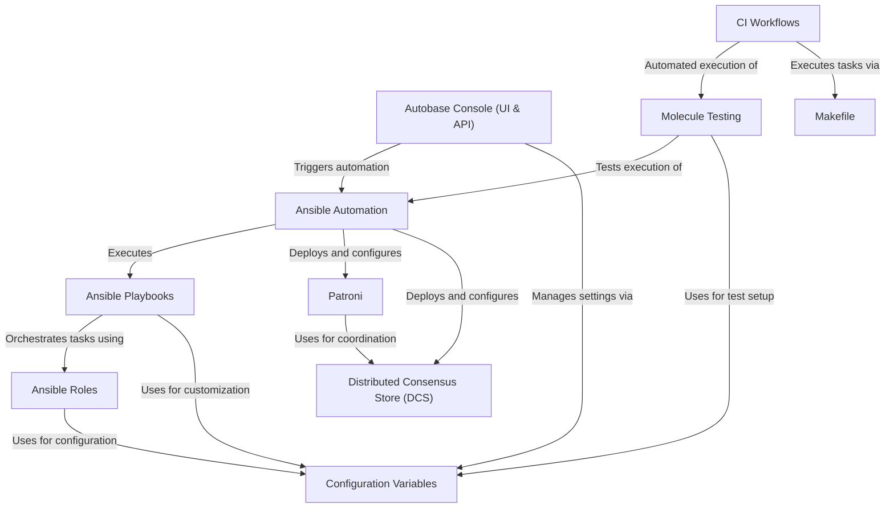

# Tutorial: autobase

Autobase for PostgreSQL® is an open-source platform designed to automate the deployment and management of **highly available PostgreSQL clusters**. It acts as an alternative to cloud DBaaS, enabling users to easily set up, configure, and maintain databases on their own infrastructure or various cloud providers using **powerful automation** and a user-friendly *Console*.

## Visual Overview

## Chapters

1. [Autobase Console (UI & API)
](01_autobase_console__ui___api__.md)
2. [Ansible Automation
](02_ansible_automation_.md)
3. [Patroni
](03_patroni_.md)
4. [Distributed Consensus Store (DCS)
](04_distributed_consensus_store__dcs__.md)
5. [Configuration Variables
](05_configuration_variables_.md)
6. [Ansible Playbooks
](06_ansible_playbooks_.md)
7. [Ansible Roles
](07_ansible_roles_.md)
8. [Molecule Testing
](08_molecule_testing_.md)
9. [CI Workflows
](09_ci_workflows_.md)
10. [Makefile
](10_makefile_.md)

---

Generated by [AI Codebase Knowledge Builder](https://github.com/The-Pocket/Tutorial-Codebase-Knowledge).