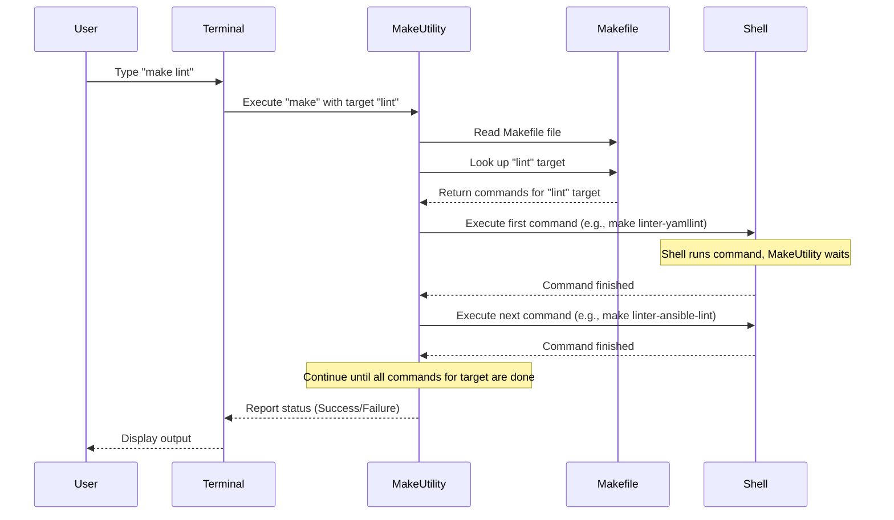

# Chapter 10: Makefile

Welcome to the final chapter of our Autobase tutorial! In our [previous chapter](09_ci_workflows_.md), we explored **CI Workflows** and saw how they automatically run various checks, like linting and testing, whenever code changes. You might have noticed that many steps in those CI workflows involved commands starting with `make`.

This brings us to the **Makefile**, the topic of this chapter.

## The Problem: Repetitive and Complex Commands

As you work on a software project like Autobase, there are many common tasks you perform repeatedly:

*   Installing development tools and dependencies.
*   Running code formatters (like Prettier).
*   Running linters to check for code style and errors (like Yamllint, Ansible-lint, Flake8).
*   Building Docker images.
*   Running tests (like [Molecule Tests](08_molecule_testing_.md)).

Each of these tasks requires typing a specific command in your terminal. These commands can sometimes be long, involve specific options, or need to be run in a particular order. Remembering all these commands and typing them correctly every time is cumbersome and error-prone. What if the command for running a linter changes slightly? You'd have to update it everywhere you use it.

We need a way to define these common tasks once and run them with a simple, easy-to-remember command.

## What is a Makefile?

A **Makefile** is essentially a file that contains a set of instructions for the `make` utility. Think of it as a **recipe book** for your development project. It lists common tasks as **targets** and provides the **commands** needed to perform each task.

When you type `make` followed by a target name (e.g., `make lint`), the `make` utility looks up that target in the Makefile and executes the commands associated with it.

Using a Makefile provides several benefits:

*   **Standardization:** It defines a standard way to perform common tasks for everyone working on the project.
*   **Simplification:** Replaces long, complex commands with short, easy-to-remember `make` targets.
*   **Consistency:** Ensures that tasks are performed the same way by all developers and the CI system.
*   **Automation:** Can define dependencies between tasks, so running one target automatically triggers others that are required first.

In the Autobase project, the Makefile standardizes tasks for developing, testing, and building the project components, especially the [Ansible Automation Engine](02_ansible_automation_.md).

## Key Concepts in a Makefile

| Concept      | Description                                                                                                | Analogy                 |
| :----------- | :--------------------------------------------------------------------------------------------------------- | :---------------------- |
| **Target**   | A named task or goal (e.g., `lint`, `build`, `test`). You tell `make` which target you want to achieve.      | The name of a recipe (e.g., "Chocolate Cake") |
| **Prerequisites** | Other targets or files that must be up-to-date or completed before the target can be executed.            | Ingredients or steps needed *before* you can bake the cake (e.g., mix batter) |
| **Commands** | The shell commands that are executed when the target is run.                                             | The actual instructions in the recipe (e.g., "Mix flour and sugar", "Bake for 30 minutes") |
| **`.PHONY` Target** | A special type of target that does not represent a file. These are used for tasks that should always run when requested, regardless of whether a file with the same name exists. | A task name that's *not* a physical item, just an action (like "Clean Kitchen") |

The core of a Makefile is defining these targets and their associated commands.

## How Autobase Uses the Makefile

Autobase uses the Makefile located at the root of the project (`Makefile`) to define shortcuts for the various development and testing commands we've discussed in previous chapters.

When you, as a developer, want to run linters or tests, you don't type the full command. You use `make`. Similarly, as we saw in [Chapter 9: CI Workflows](09_ci_workflows_.md), the GitHub Actions workflows use `make` targets to execute their steps.

Let's look at a few common use cases and the simple `make` commands you'd use:

| Task                                  | Complex Command (Example)                                    | Simple `make` Command    |
| :------------------------------------ | :----------------------------------------------------------- | :----------------------- |
| Install development dependencies      | `python3.12 -m venv .venv && source .venv/bin/activate && pip install -r requirements_dev.txt` | `make bootstrap-dev`     |
| Run all linters                       | `make linter-yamllint && make linter-ansible-lint && make linter-flake8` | `make lint`              |
| Run Molecule tests (default scenario) | `molecule test -s default` (within the correct environment)  | `make molecule-test`     |
| Build the Docker image                | `docker build -f automation/Dockerfile -t autobase/automation:latest automation/` | `make docker-build`      |
| Run all project tests (lint, molecule)| Combines multiple steps manually                             | `make tests`             |

This table shows how `make` commands abstract away the complexity of the underlying commands.

## Looking Inside the Autobase Makefile

The `Makefile` uses YAML-like syntax (but it's not YAML!). Each target is defined with the target name, followed by a colon, and then the commands to run, indented below it.

Here are a few simplified snippets from the Autobase `Makefile`:

**Defining PHONY targets:**

```makefile
.PHONY: all SHELL
# ... other PHONY targets ...
.PHONY: bootstrap
.PHONY: bootstrap-dev
# ... more PHONY targets ...
```
This section declares targets like `bootstrap`, `bootstrap-dev`, `clean`, `tests`, `lint`, etc., as `.PHONY`. This ensures that `make` will always execute the commands for these targets when you request them, even if you accidentally create a file named `bootstrap` in your project directory.

**The `bootstrap-dev` target:**

```makefile
.PHONY: bootstrap-dev
bootstrap-dev: ## Bootstrap Ansible collection for development
	$(MAKE) bootstrap
	$(MAKE) python-bootstrap-dev
```
This target is used to set up the development environment. Notice it calls other `make` targets (`$(MAKE) bootstrap` and `$(MAKE) python-bootstrap-dev`). The `##` comment is a special format often used to generate help messages (seen when you just type `make`).

**The `lint` target:**

```makefile
.PHONY: lint
lint: ## Lint your code
	$(MAKE) linter-yamllint
	$(MAKE) linter-ansible-lint
	$(MAKE) linter-flake8
	$(MAKE) docker-lint
```
This target shows how one `make` target can depend on and execute *other* `make` targets. When you run `make lint`, `make` will execute `make linter-yamllint`, then `make linter-ansible-lint`, and so on, ensuring all linters are run.

**The `molecule-test` target:**

```makefile
.PHONY: molecule-test
molecule-test: ## Run Molecule tests
	molecule test -s default
```
This is a straightforward target. It simply executes the `molecule test -s default` command, which runs the [Molecule Tests](08_molecule_testing_.md) for the default scenario on the test instances defined in the Molecule configuration. As we saw in [Chapter 9](09_ci_workflows_.md), the CI workflows use this target but pass environment variables (`IMAGE_DISTRO`, etc.) to control which operating system images Molecule uses.

**The `docker-build` target:**

```makefile
.PHONY: docker-build
docker-build: ## Run Docker build
	docker build -f automation/Dockerfile -t autobase/automation:${TAG:-latest} automation/
```
This target runs the Docker build command. It uses a shell variable `${TAG:-latest}`, which means it will use the value of the environment variable `TAG` if set, or default to `latest` if not. This allows the CI workflow to build images with specific version tags by setting the `TAG` environment variable before calling `make docker-build`.

## How Makefile Commands Execute (Simplified)

When you type a `make` command like `make lint` in your terminal:



This simplified flow shows that the `make` utility acts as an intermediary. It reads the Makefile, identifies the target you requested, and then executes the commands listed under that target, typically by passing them to your system's shell.

## Finding Makefile Targets

The easiest way to see the main available targets in the Autobase Makefile is to simply type `make` in your terminal from the project's root directory. Because `.DEFAULT_GOAL` is set to `help` and the `help` target uses the `##` comments to display a list, this will print a helpful list of common commands.

You can also open the `Makefile` file itself located at the root of the project repository to read all the targets and commands.

## Conclusion

The Makefile is an essential tool in the Autobase project for streamlining the development workflow. It provides simple `make` commands that act as shortcuts for frequently used tasks like installing dependencies, running linters, executing tests, and building Docker images. This standardization benefits individual developers by saving time and reducing errors, and is crucial for the project's automated CI Workflows, ensuring consistent and reliable quality checks across the board.

You now understand what a Makefile is, its core concepts, how it's used in Autobase to simplify common tasks, and how it fits into the overall development and CI process.

This concludes our journey through the key concepts of the Autobase project. We hope this tutorial has provided you with a solid foundation for understanding how Autobase works and exploring its codebase further!

---

<sub><sup>Generated by [AI Codebase Knowledge Builder](https://github.com/The-Pocket/Tutorial-Codebase-Knowledge).</sup></sub> <sub><sup>**References**: [[1]](https://github.com/vitabaks/autobase/blob/190aaf8616fc3f12dae58cdb3731af69f97ff013/.config/gitpod/Dockerfile), [[2]](https://github.com/vitabaks/autobase/blob/190aaf8616fc3f12dae58cdb3731af69f97ff013/.github/workflows/ansible-lint.yml), [[3]](https://github.com/vitabaks/autobase/blob/190aaf8616fc3f12dae58cdb3731af69f97ff013/.github/workflows/docker.yml), [[4]](https://github.com/vitabaks/autobase/blob/190aaf8616fc3f12dae58cdb3731af69f97ff013/.github/workflows/molecule.yml), [[5]](https://github.com/vitabaks/autobase/blob/190aaf8616fc3f12dae58cdb3731af69f97ff013/CONTRIBUTING.md), [[6]](https://github.com/vitabaks/autobase/blob/190aaf8616fc3f12dae58cdb3731af69f97ff013/Makefile)</sup></sub>
