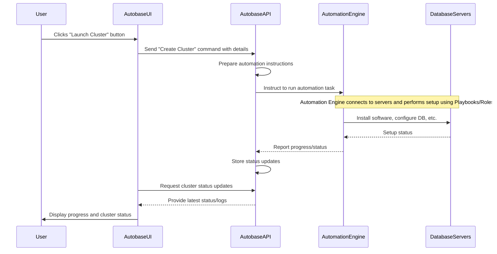

# Chapter 1: Autobase Console (UI & API)

Welcome to the first chapter of the Autobase tutorial! In this chapter, we're going to explore the **Autobase Console**. Think of it as the main control center for managing your PostgreSQL databases using Autobase.

## What is the Autobase Console?

Imagine you're managing a fleet of powerful rockets (your databases). You need a control room where you can see what each rocket is doing, launch new ones, and make sure they are healthy. That's what the Autobase Console is for your databases!

The Autobase Console helps you manage your PostgreSQL database clusters without needing to remember complex commands. It's designed to be easy to use, even if you're new to managing databases or automation tools.

The Console is made up of two main parts:

1.  **The UI (User Interface):** This is the part you see and interact with – the web page with buttons, forms, and dashboards. It's your view into the control room.
2.  **The API (Application Programming Interface):** This is the engine behind the scenes. When you click a button in the UI, the UI talks to the API. The API then figures out what needs to be done and sends instructions to the right tools to make it happen. It's the system that carries out your commands.

The big problem the Console solves is making database cluster management simple and visual. Instead of typing commands into a terminal, you can point and click to get things done.

## Your First Mission: Launching a Database Cluster

Let's look at a common task: launching a brand new PostgreSQL cluster. Without Autobase, this involves many steps: setting up servers, installing PostgreSQL, configuring high availability, etc. With the Autobase Console, it becomes much simpler.

Here's how you'd typically do it using the Console:

1.  You open the Autobase Console UI in your web browser.
2.  You navigate to a section like "Clusters" or "Create New Cluster".
3.  You fill out a simple form specifying details like the cluster name, how many database servers you want, and maybe where they should run (like in a cloud provider or on your own servers).
4.  You click a button that says something like "Launch Cluster".

That's it from your perspective! The Console takes care of the rest.

## How the Console Works Behind the Scenes

When you click that "Launch Cluster" button, here's a simplified look at what happens:

1.  The **Autobase UI** (what you see in your browser) sends a message to the **Autobase API**. This message contains all the details you entered in the form (cluster name, number of servers, etc.).
2.  The **Autobase API** (the Go program running on a server) receives the message. It understands that you want to launch a new cluster.
3.  The API doesn't build the cluster itself. Instead, it knows how to talk to another powerful tool that's designed for automating tasks: [Ansible Automation](02_ansible_automation_.md). The API prepares the instructions (like a detailed mission plan) and tells [Ansible Automation](02_ansible_automation_.md) to execute them.
4.  [Ansible Automation](02_ansible_automation_.md) then connects to your servers and performs all the necessary steps: installing software, configuring PostgreSQL, setting up replication, configuring high availability using [Patroni](03_patroni_.md), etc. It does this by running predefined scripts called [Ansible Playbooks](06_ansible_playbooks_.md).
5.  As [Ansible Automation](02_ansible_automation_.md) works, it reports its progress back. The **Autobase API** receives these updates and stores them.
6.  The **Autobase UI** periodically checks with the API for updates. It then displays the progress and logs in your browser, showing you the mission status in real-time.

Here's a little diagram to visualize this flow:



This sequence shows how the Console acts as the middleman, translating your clicks into actions performed by the automation engine on your servers.

## Where to Find the Console Code

The code for the Autobase Console lives within the `console` directory in the project.

*   The web interface code (the UI) is in `console/ui/`. This is built using technologies like React (as seen in `console/ui/src/app/App.tsx`).
*   The backend service code (the API) is in `console/service/`. This is a Go program (`console/service/main.go` is the main file).

You don't need to dive into the code right now to use Autobase. The easiest way to get the Console running is by using Docker. The project provides instructions, often involving a command like this (from the README):

```bash
docker run -d --name autobase-console \
  --publish 80:80 \
  --publish 8080:8080 \
  --env PG_CONSOLE_API_URL=http://localhost:8080/api/v1 \
  --env PG_CONSOLE_AUTHORIZATION_TOKEN=secret_token \
  --env PG_CONSOLE_DOCKER_IMAGE=autobase/automation:latest \
  --volume console_postgres:/var/lib/postgresql \
  --volume /var/run/docker.sock:/var/run/docker.sock \
  --volume /tmp/ansible:/tmp/ansible \
  --restart=unless-stopped \
  autobase/console:latest
```
This `docker run` command pulls the pre-built Autobase Console image (`autobase/console:latest`) and runs it. It sets up networking (`--publish`), configures the API URL and a simple authorization token (`--env`), and mounts necessary volumes (`--volume`) for data and communication with the Docker engine and the automation engine. This single command launches both the UI and the API components, along with a small internal database the console uses to store information about your clusters.

Alternatively, the project provides a `docker-compose.yml` file (`console/docker-compose.yml`) which does a similar job but breaks the Console into separate services (UI, API, database, and a proxy like Caddy) for better organization.

These Docker setups package the UI and API together so you can run the control center easily.

## Conclusion

The Autobase Console is your primary interface for interacting with Autobase. It provides a user-friendly UI to visualize and manage your PostgreSQL clusters and a powerful API backend that orchestrates the actual work by communicating with the [Ansible Automation](02_ansible_automation_.md) engine.

You learned how the Console helps you launch a database cluster with a few clicks, and got a high-level understanding of the UI, API, and their interaction.

In the next chapter, we'll zoom in on that crucial component that the API talks to: [Ansible Automation](02_ansible_automation_.md).

[Next Chapter: Ansible Automation](02_ansible_automation_.md)

---

<sub><sup>Generated by [AI Codebase Knowledge Builder](https://github.com/The-Pocket/Tutorial-Codebase-Knowledge).</sup></sub> <sub><sup>**References**: [[1]](https://github.com/vitabaks/autobase/blob/190aaf8616fc3f12dae58cdb3731af69f97ff013/README.md), [[2]](https://github.com/vitabaks/autobase/blob/190aaf8616fc3f12dae58cdb3731af69f97ff013/console/Dockerfile), [[3]](https://github.com/vitabaks/autobase/blob/190aaf8616fc3f12dae58cdb3731af69f97ff013/console/README.md), [[4]](https://github.com/vitabaks/autobase/blob/190aaf8616fc3f12dae58cdb3731af69f97ff013/console/docker-compose.yml), [[5]](https://github.com/vitabaks/autobase/blob/190aaf8616fc3f12dae58cdb3731af69f97ff013/console/service/Dockerfile), [[6]](https://github.com/vitabaks/autobase/blob/190aaf8616fc3f12dae58cdb3731af69f97ff013/console/service/main.go), [[7]](https://github.com/vitabaks/autobase/blob/190aaf8616fc3f12dae58cdb3731af69f97ff013/console/ui/README.md), [[8]](https://github.com/vitabaks/autobase/blob/190aaf8616fc3f12dae58cdb3731af69f97ff013/console/ui/src/app/App.tsx)</sup></sub>
