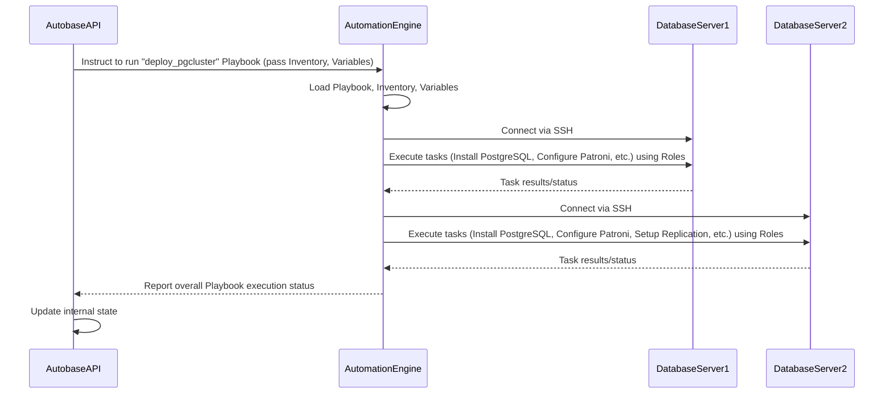

# Chapter 2: Ansible Automation

Welcome back! In our [first chapter](01_autobase_console__ui___api__.md), we explored the Autobase Console – your central control room for managing PostgreSQL clusters. We saw how the Console UI lets you click buttons to perform actions, and how the Console API works behind the scenes to make those actions happen.

We also learned that the API doesn't *do* the complex server setup itself. Instead, it delegates that work to another powerful tool: **Ansible Automation**.

## Why Automation?

Imagine you need to set up 5 database servers. For *each* server, you have to:
*   Install PostgreSQL
*   Configure PostgreSQL settings
*   Create users and databases
*   Set up replication between servers
*   Configure a high-availability tool
*   Set up firewall rules
*   And much more!

Doing this manually, one server at a time, is slow, repetitive, and easy to mess up. What if you need to set up 50 servers? Or apply an update to all of them? Manual steps become impossible to manage reliably.

This is where automation comes in. Automation lets you define the desired state of your servers once and then apply that definition automatically to many servers. It's like writing down a recipe and having a robot follow it precisely every time.

## What is Ansible Automation?

In the world of Autobase, **Ansible Automation is the engine that performs the actual work on your servers.** Think of it as the skilled construction crew that takes the blueprints (instructions) from the Autobase API and builds, configures, and maintains your PostgreSQL clusters on the machines you provide.

The core idea of Ansible is to describe the *end state* you want your servers to be in, rather than writing step-by-step commands. You tell Ansible: "Make sure PostgreSQL version X is installed, user Y exists, and configuration file Z has these specific lines." Ansible then figures out the best way to achieve that state, whether it's installing a package, creating a file, or starting a service.

This approach is called "declarative automation".

Autobase uses Ansible for almost every operation that involves touching the database servers:
*   Initial cluster deployment
*   Configuring PostgreSQL and related tools ([Patroni](03_patroni_.md), [DCS](04_distributed_consensus_store__dcs__.md))
*   Adding or removing database nodes
*   Performing upgrades
*   Applying configuration changes

## Key Concepts in Ansible (for Autobase)

While Ansible is a large and powerful tool, when used by Autobase, you primarily interact with it indirectly. However, understanding a few core concepts will help you see how Autobase works:

1.  **Control Node:** This is the machine where Ansible runs. In Autobase, this is typically the Docker container running the `autobase/automation:latest` image. This is where the "construction crew" (Ansible) lives.
2.  **Managed Nodes (or Hosts):** These are the target servers where you want to manage your PostgreSQL clusters. These are the "construction sites". Ansible connects to these servers, usually via SSH, to perform tasks.
3.  **Inventory:** This is a file or data structure that lists your Managed Nodes. It tells Ansible *which* servers belong to *which* groups (like "master", "replica", "etcd_cluster"). It's like the address book for the construction crew. Autobase provides this inventory data to the Ansible engine when it triggers a task.
4.  **Playbooks:** These are the main scripts in Ansible. They define a series of tasks to be executed on specific groups of servers defined in the Inventory. Think of a Playbook as the complete master plan for building a specific type of structure (like a PostgreSQL cluster). We'll explore Playbooks more in [Chapter 6](06_ansible_playbooks_.md).
5.  **Roles:** Playbooks are often organized using Roles. A Role is a bundle of related tasks, files, templates, and variables designed to accomplish a specific goal (like "install PostgreSQL" or "configure Patroni"). Roles are reusable components. Think of a Role as a specific set of instructions for a part of the structure (like the foundation, the walls, or the roof). We'll cover Roles in detail in [Chapter 7](07_ansible_roles_.md).

## How Autobase Uses Ansible to Launch a Cluster

Let's revisit the cluster launch example from [Chapter 1](01_autobase_console__ui___api__.md) and focus on the Ansible part:

1.  You tell the **Autobase Console UI** to create a new cluster.
2.  The **UI** sends the request to the **Autobase API**.
3.  The **API** receives the request and prepares the necessary information:
    *   A list of your database servers (the **Inventory**).
    *   Configuration details for the cluster (these become **Configuration Variables** for Ansible, covered in [Chapter 5](05_configuration_variables_.md)).
    *   Which specific Ansible **Playbook** to run (e.g., `deploy_pgcluster`).
4.  The **API** then instructs the **Autobase Automation Engine** (the Docker container running Ansible) to execute the specified Playbook, providing it with the Inventory and Variables.
5.  The **Ansible Automation Engine** takes the Inventory, connects to each server listed via SSH, and starts executing the `deploy_pgcluster` Playbook.
6.  The `deploy_pgcluster` **Playbook** orchestrates the setup. It uses various **Roles** (like a PostgreSQL Role, a Patroni Role, an ETCD or Consul Role) to perform tasks on the appropriate servers (Master, Replica, DCS servers).
7.  As Ansible runs tasks, it reports its progress. The **Autobase API** monitors this progress and updates the **Console UI**, so you can see the status of your cluster deployment.

Here's a simplified view of the automation flow:



This diagram shows that Ansible acts on the database servers based on the instructions and data provided by the Autobase API.

## The Autobase Automation Engine (Under the Hood)

Autobase packages its Ansible code and all necessary dependencies into a Docker image, `autobase/automation:latest`. This is what the Console launches when it needs to perform an automation task.

You can find the code for this automation engine within the `automation/` directory in the Autobase project repository.

*   `automation/`: This is the root directory for the Ansible code.
*   `automation/playbooks/`: Contains the main Ansible Playbooks (like `deploy_pgcluster.yml`).
*   `automation/roles/`: Contains the reusable Ansible Roles (e.g., `roles/postgresql/`, `roles/patroni/`).
*   `automation/inventory.example`: An example of an Inventory file structure.
*   `automation/requirements.yml`: Lists the external Ansible Collections that Autobase depends on (like collections for managing PostgreSQL, Docker, or cloud providers).
*   `automation/Dockerfile`: Defines how the `autobase/automation` Docker image is built, installing Ansible, Python dependencies, and the necessary collections.
*   `automation/entrypoint.sh`: A script run when the Docker container starts. It's responsible for taking configuration (like your server inventory or SSH keys) passed in via environment variables from the Autobase API and setting up the environment for Ansible to run.

Let's look at a snippet from the `entrypoint.sh` script to see how it handles the inventory:

```bash
# automation/entrypoint.sh (Simplified Snippet)
#!/bin/bash

# Check if ANSIBLE_INVENTORY_JSON is set...
if [[ -n "${ANSIBLE_INVENTORY_JSON}" ]]; then
  # ...decode it if needed, write it to a file...
  if is_base64 "${ANSIBLE_INVENTORY_JSON}"; then
    echo "${ANSIBLE_INVENTORY_JSON}" | base64 -d > /autobase/inventory.json
  else
    echo "${ANSIBLE_INVENTORY_JSON}" > /autobase/inventory.json
  fi
  # ... and tell Ansible to use this file as the inventory.
  export ANSIBLE_INVENTORY=/autobase/inventory.json
fi

# ... (Similar logic for SSH_PRIVATE_KEY_CONTENT) ...

# Execute the command passed to the container (e.g., ansible-playbook ...)
exec "$@"
```

This shows how the Autobase API running the container can pass the server inventory as a JSON string via the `ANSIBLE_INVENTORY_JSON` environment variable. The `entrypoint.sh` script then decodes and saves it to `/autobase/inventory.json`, making it available for the Ansible commands run within the container.

The core of the automation logic lives within the Playbooks and Roles. While we won't dive deep into writing them yet, here's a tiny glimpse of what an Ansible Inventory structure might look like:

```yaml
# Example Inventory Structure (Simplified)
all:
  hosts:
    server1.example.com:
      ansible_host: 192.168.1.10 # Private IP
      ansible_user: ubuntu
    server2.example.com:
      ansible_host: 192.168.1.11
      ansible_user: ubuntu
    server3.example.com:
      ansible_host: 192.168.1.12
      ansible_user: ubuntu
  children:
    postgres_cluster:
      hosts:
        server1.example.com: # This will be the master initially
        server2.example.com: # Replica
        server3.example.com: # Replica
    etcd_cluster:
      hosts:
        server1.example.com:
        server2.example.com:
        server3.example.com:
```

And a *very* simplified Playbook that might use this inventory:

```yaml
# Simplified Playbook Example (Not the actual deploy_pgcluster)
- name: Deploy a basic PostgreSQL cluster
  hosts: postgres_cluster # Run tasks on servers in the 'postgres_cluster' group
  roles:
    - common # Setup common things first
    - postgresql # Install and configure PostgreSQL
    - patroni # Install and configure Patroni
```

This tiny example shows the declarative nature: "On these `hosts`, apply these `roles`." Ansible handles the SSH connections, package installations, file edits, service restarts, and checks whether tasks need to be run (if the desired state is already met, it skips the task).

## Conclusion

Ansible Automation is the workhorse of the Autobase project. It takes the high-level instructions from the Autobase Console API and translates them into concrete actions on your servers, ensuring your PostgreSQL clusters are set up and configured reliably and efficiently.

You learned that Ansible uses concepts like Inventories (where to act), Playbooks (the plan), and Roles (reusable tasks) to achieve the desired state of your infrastructure. This automation is crucial for managing complex database setups like high availability and scaling across multiple machines.

In the next chapter, we'll dive into [Patroni](03_patroni_.md), one of the key tools that Ansible helps configure, which is responsible for making your PostgreSQL cluster highly available.

[Next Chapter: Patroni](03_patroni_.md)

---

<sub><sup>Generated by [AI Codebase Knowledge Builder](https://github.com/The-Pocket/Tutorial-Codebase-Knowledge).</sup></sub> <sub><sup>**References**: [[1]](https://github.com/vitabaks/autobase/blob/190aaf8616fc3f12dae58cdb3731af69f97ff013/Makefile), [[2]](https://github.com/vitabaks/autobase/blob/190aaf8616fc3f12dae58cdb3731af69f97ff013/README.md), [[3]](https://github.com/vitabaks/autobase/blob/190aaf8616fc3f12dae58cdb3731af69f97ff013/automation/Dockerfile), [[4]](https://github.com/vitabaks/autobase/blob/190aaf8616fc3f12dae58cdb3731af69f97ff013/automation/README.md), [[5]](https://github.com/vitabaks/autobase/blob/190aaf8616fc3f12dae58cdb3731af69f97ff013/automation/entrypoint.sh), [[6]](https://github.com/vitabaks/autobase/blob/190aaf8616fc3f12dae58cdb3731af69f97ff013/automation/galaxy.yml), [[7]](https://github.com/vitabaks/autobase/blob/190aaf8616fc3f12dae58cdb3731af69f97ff013/automation/requirements.yml)</sup></sub>
