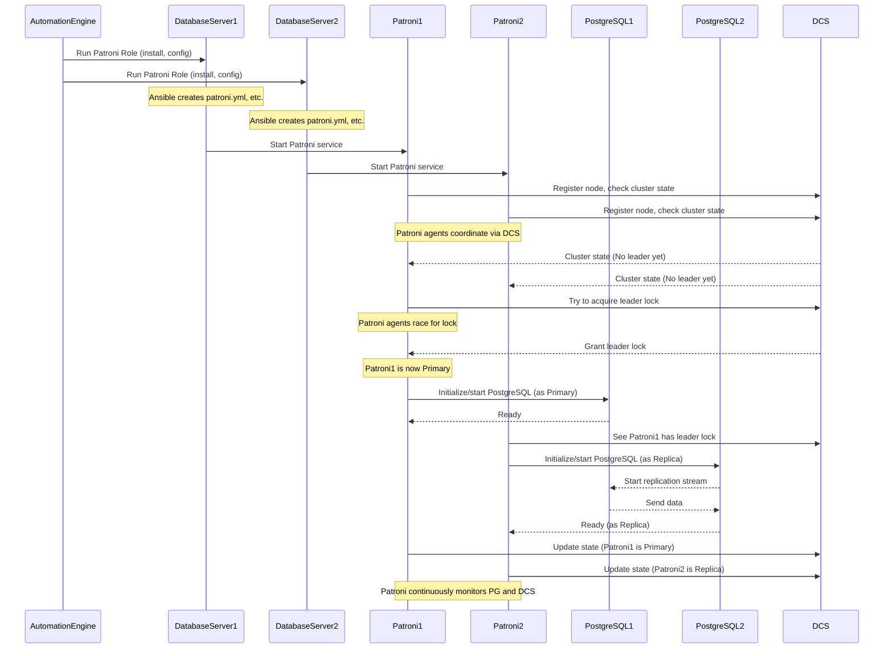

# Chapter 3: Patroni

Welcome back! In our last chapter, [Chapter 2: Ansible Automation](02_ansible_automation_.md), we learned that Autobase uses [Ansible Automation](02_ansible_automation_.md) as its powerful "construction crew" to build and manage your database infrastructure on servers. Ansible handles the tasks like installing software and configuring systems.

Now, let's look at one of the most important pieces of software that [Ansible Automation](02_ansible_automation_.md) installs and configures for your PostgreSQL clusters: **Patroni**.

## The Problem: What Happens When Your Database Server Goes Down?

Imagine you have a single server running your PostgreSQL database. This database stores critical information for your application or website. What happens if that server suddenly crashes?

*   Your application can't access the database.
*   Users can't log in, make purchases, or view data.
*   Your service is unavailable!

This is a major problem for anything that needs to be available all the time, like online stores, banking systems, or critical internal tools. You need a way for your database service to continue running even if one server fails. This is called **High Availability (HA)**.

## What is Patroni?

Patroni is the "smart supervisor" for your PostgreSQL databases, specifically designed to provide **High Availability**. It's an open-source tool built using Python.

Think of Patroni as the conductor of a database orchestra. It doesn't play the instruments itself (PostgreSQL does that), but it makes sure all the musicians (database servers) are playing together correctly.

Here's what Patroni does:

1.  **It watches over your PostgreSQL servers:** It constantly checks if each server is healthy and running.
2.  **It knows who the leader is:** In a high-availability setup, only one server is the **Primary** (also called the Master), where all the writes happen. The other servers are **Replicas** (also called Standbys), which copy data from the Primary. Patroni keeps track of which server is currently the Primary.
3.  **It manages replication:** Patroni helps set up and maintain the process where Replicas automatically copy data from the Primary, ensuring they have an up-to-date copy.
4.  **It handles failover:** If the Primary server unexpectedly goes down, Patroni detects this. It then coordinates with the other servers to automatically **elect** one of the healthy Replicas to become the new Primary. This happens with minimal interruption to your database service.
5.  **It manages switchover:** You can also tell Patroni to perform a planned role change, like making a specific Replica the new Primary for maintenance purposes.
6.  **It uses a central store (DCS):** To make sure all Patroni agents on different servers agree on who the Primary is and the overall cluster state, they communicate through a reliable external service called a [Distributed Consensus Store (DCS)](04_distributed_consensus_store__dcs__.md). We'll talk more about DCS in the next chapter.

In short, Patroni automates the complex tasks needed to keep your PostgreSQL cluster running smoothly and available, even when servers fail.

## Key Patroni Concepts

Let's quickly define the main roles Patroni manages:

| Concept     | Description                                                                |
| :---------- | :------------------------------------------------------------------------- |
| **Primary** | The one database server in the cluster that can accept writes (INSERT, UPDATE, DELETE). There is only one Primary at any time. |
| **Replica** | A database server that copies data from the Primary. It can typically handle read-only queries (SELECT). There can be multiple Replicas. |
| **Replication** | The process of data being copied from the Primary to the Replicas.      |
| **Failover** | The automatic process where Patroni promotes a healthy Replica to be the new Primary when the current Primary fails unexpectedly. |
| **Switchover**| A planned and controlled process initiated by a user or tool (like Autobase) to change the Primary role to a different server. |
| **DCS**     | [Distributed Consensus Store](04_distributed_consensus_store__dcs__.md) (like ETCD or Consul). Patroni uses this as a shared brain to store the cluster state. |

## How Autobase Uses Patroni (via Ansible)

When you use the [Autobase Console](01_autobase_console__ui___api__.md) to launch or manage a PostgreSQL cluster, the [Autobase API](01_autobase_console__ui___api__.md) tells the [Ansible Automation](02_ansible_automation_.md) engine to perform tasks on your servers. A significant part of these tasks involves installing and configuring Patroni.

Autobase doesn't reinvent how Patroni works; it uses [Ansible Automation](02_ansible_automation_.md) to deploy and manage Patroni according to your desired cluster setup and [Configuration Variables](05_configuration_variables_.md).

The process generally looks like this:

1.  You initiate a database cluster operation (like "Create Cluster") through the [Autobase Console](01_autobase_console__ui___api__.md).
2.  The [Autobase API](01_autobase_console__ui___api__.md) prepares instructions for the [Ansible Automation](02_ansible_automation_.md) engine, including details like the cluster name, the list of servers, database users, and configuration settings.
3.  The [Ansible Automation](02_ansible_automation_.md) engine starts running the relevant [Ansible Playbook](06_ansible_playbooks_.md) on your servers.
4.  The Playbook includes steps that use the `patroni` [Ansible Role](07_ansible_roles_.md).
5.  The `patroni` Role performs all the necessary tasks on each server:
    *   Installs the Patroni software.
    *   Generates the Patroni configuration file (`patroni.yml`) based on the provided [Configuration Variables](05_configuration_variables_.md). This file tells Patroni how to find the [DCS](04_distributed_consensus_store__dcs__.md), where the PostgreSQL data is located, network addresses, etc.
    *   Sets up the Patroni system service so it starts automatically and can be managed (started, stopped, restarted) by the operating system.
    *   Ensures the PostgreSQL data directory and other necessary paths are ready for Patroni to use.
6.  Once Patroni is configured and started on the servers, the Patroni agents on each server communicate with each other via the [DCS](04_distributed_consensus_store__dcs__.md) to establish which server is the Primary and to start replication.

## A Simplified Look Inside the Patroni Ansible Role

The code responsible for setting up Patroni lives in the `automation/roles/patroni/` directory. Let's peek at some simplified tasks from `automation/roles/patroni/tasks/main.yml`.

First, installing Patroni (could be via `pip` or packages):

```yaml
# automation/roles/patroni/tasks/main.yml (Simplified Snippet)
- name: Install patroni package (via pip)
  ansible.builtin.pip:
    name: patroni
    state: latest
    executable: pip3
  environment: "{{ proxy_env | default({}) }}"
  when: patroni_installation_method == "pip"
  tags: patroni, patroni_install

- name: Install patroni package (via apt)
  ansible.builtin.apt:
    name: "{{ patroni_packages | flatten }}"
    state: present
  environment: "{{ proxy_env | default({}) }}"
  when: ansible_os_family == "Debian" and patroni_installation_method != "pip"
  tags: patroni, patroni_install

# ... other installation methods (rpm/dnf) ...
```

This snippet shows Ansible using either the `pip` module or the `apt` module (for Debian/Ubuntu) to install the Patroni software based on variables like `patroni_installation_method` and `ansible_os_family`.

Next, creating the configuration file using a template:

```yaml
# automation/roles/patroni/tasks/main.yml (Simplified Snippet)
- name: Create conf directory /etc/patroni
  ansible.builtin.file:
    path: /etc/patroni
    state: directory
    owner: postgres
    group: postgres
    mode: "0750"
  tags: patroni, patroni_conf

- name: Generate conf file "/etc/patroni/patroni.yml"
  ansible.builtin.template:
    src: templates/patroni.yml.j2 # This is a Jinja2 template file
    dest: /etc/patroni/patroni.yml
    owner: postgres
    group: postgres
    mode: "0640"
  tags: patroni, patroni_conf

# ... tasks to prepare postgresql data directory, etc ...
```

Here, Ansible ensures the `/etc/patroni` directory exists and then uses the `template` module. The `patroni.yml.j2` file is a template (found in `automation/roles/patroni/templates/`) that contains placeholders filled in by Ansible using the [Configuration Variables](05_configuration_variables_.md) provided by the Autobase API (like `patroni_cluster_name`, DCS connection details, database settings). The output is the final `patroni.yml` configuration file on the server.

Then, setting up the system service:

```yaml
# automation/roles/patroni/tasks/main.yml (Simplified Snippet)
- name: Copy systemd service file "/etc/systemd/system/patroni.service"
  ansible.builtin.template:
    src: templates/patroni.service.j2 # Template for the systemd service unit file
    dest: /etc/systemd/system/patroni.service
    owner: postgres
    group: postgres
    mode: "0644"
  tags: patroni, patroni_conf, patroni_service

- name: Start patroni service
  ansible.builtin.systemd:
    daemon_reload: true # Reload systemd so it sees the new file
    name: patroni
    state: started # Ensure the service is started
    enabled: true # Ensure the service starts on boot
  tags: patroni, patroni_start_master, patroni_start_replica
```

This uses another template (`patroni.service.j2`) to create the file that tells the operating system how to manage the Patroni service. The `systemd` module then tells the OS to reload its configuration, start Patroni, and make sure it starts automatically when the server boots.

These are just a few examples, but they illustrate how the `patroni` Ansible Role automates all the necessary steps to get Patroni running and configured on your database servers as part of the larger cluster deployment managed by Autobase.

## Visualizing Patroni Deployment and Interaction

Let's visualize the part where Ansible sets up Patroni and how Patroni then starts managing PostgreSQL and talking to the DCS.



This diagram shows how Ansible sets the stage by installing and configuring Patroni. Once started, the Patroni agents on each server use the DCS to figure out their roles, initialize PostgreSQL accordingly, and establish replication. They then continue communicating via the DCS to maintain cluster health and perform failovers/switchovers if needed.

## Conclusion

Patroni is a critical component for achieving high availability with PostgreSQL. It acts as a smart supervisor, automating the tasks of monitoring, replication, and failover. Autobase leverages the power of [Ansible Automation](02_ansible_automation_.md) to deploy and configure Patroni seamlessly across your database servers, making it much easier to set up and manage resilient PostgreSQL clusters.

You've seen how Patroni solves the problem of database downtime and the basic roles it manages. You also got a glimpse into how Autobase uses its `patroni` Ansible Role to automate the installation and configuration process.

In the next chapter, we'll take a closer look at the [Distributed Consensus Store (DCS)](04_distributed_consensus_store__dcs__.md), the crucial piece that Patroni relies on to coordinate across multiple servers and ensure they agree on the true state of the cluster.

[Next Chapter: Distributed Consensus Store (DCS)](04_distributed_consensus_store__dcs__.md)

---

<sub><sup>Generated by [AI Codebase Knowledge Builder](https://github.com/The-Pocket/Tutorial-Codebase-Knowledge).</sup></sub> <sub><sup>**References**: [[1]](https://github.com/vitabaks/autobase/blob/190aaf8616fc3f12dae58cdb3731af69f97ff013/.config/molecule/config.yml), [[2]](https://github.com/vitabaks/autobase/blob/190aaf8616fc3f12dae58cdb3731af69f97ff013/automation/molecule/tests/patroni/patroni.yml), [[3]](https://github.com/vitabaks/autobase/blob/190aaf8616fc3f12dae58cdb3731af69f97ff013/automation/playbooks/add_pgnode.yml), [[4]](https://github.com/vitabaks/autobase/blob/190aaf8616fc3f12dae58cdb3731af69f97ff013/automation/playbooks/config_pgcluster.yml), [[5]](https://github.com/vitabaks/autobase/blob/190aaf8616fc3f12dae58cdb3731af69f97ff013/automation/playbooks/pg_upgrade.yml), [[6]](https://github.com/vitabaks/autobase/blob/190aaf8616fc3f12dae58cdb3731af69f97ff013/automation/roles/patroni/README.md), [[7]](https://github.com/vitabaks/autobase/blob/190aaf8616fc3f12dae58cdb3731af69f97ff013/automation/roles/patroni/tasks/main.yml)</sup></sub>
