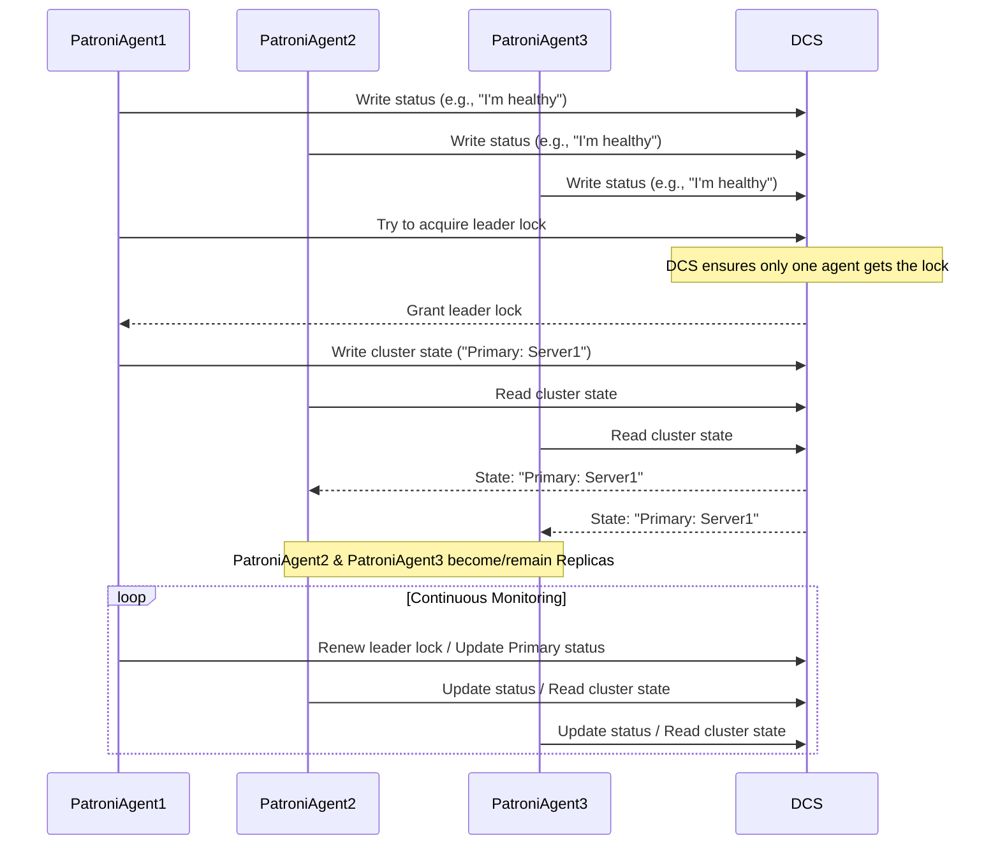

# Chapter 4: Distributed Consensus Store (DCS)

Welcome back! In our [previous chapter](03_patroni_.md), we learned about Patroni, the crucial tool that provides High Availability for PostgreSQL by supervising your database servers and managing failovers.

We briefly mentioned that Patroni agents, running on different servers, need a way to communicate and agree on the cluster's state, especially who the **Primary** database server is. If they didn't agree, you could end up with multiple servers thinking they are the primary (a "split-brain" scenario), which can lead to data corruption!

So, how do these Patroni agents, spread across different machines, stay in sync and avoid this problem?

## The Problem: Getting Distributed Servers to Agree

Imagine you have three friends (Patroni agents) living in different houses (servers). They are all responsible for supervising a shared task (the PostgreSQL cluster). They need to know things like:

*   "Who is currently the main leader for this task?"
*   "What is the latest status of the task?"
*   "If the leader stops, who should take over?"

If they just shouted across the street to each other, messages could get lost or arrive out of order. How can they all get the same, reliable information at the same time, and agree on who makes decisions?

## What is a Distributed Consensus Store (DCS)?

This is where the **Distributed Consensus Store (DCS)** comes in. Think of the DCS as that "shared whiteboard" or a "central brain" that all the Patroni agents can reliably read from and write to.

The DCS's main job is to provide a way for a group of distributed systems (like our Patroni agents) to **agree on a single source of truth**, even if some parts of the system (servers or network connections) fail. This is called **consensus**.

Autobase uses one of two popular technologies for the DCS:

1.  **etcd:** A highly consistent and distributed key-value store. It's widely used for coordinating and managing cluster states.
2.  **Consul:** A tool for service discovery, configuration, and orchestration, which also includes a strong key-value store feature used by Patroni.

Both etcd and Consul provide the necessary features for Patroni to function:

*   **Reliable Storage:** They can store small pieces of information (like the current Primary server's address) reliably across multiple DCS servers.
*   **Consensus:** They use complex algorithms to ensure that even if a few DCS servers fail, the remaining ones can still agree on the data they hold.
*   **Watching:** Patroni can "watch" specific entries in the DCS and be notified immediately when they change (e.g., the entry indicating who the Primary is).

In essence, the DCS is the backbone that allows Patroni to coordinate the state of your PostgreSQL cluster and perform automatic failovers safely.

## How Patroni Uses the DCS

Let's look closer at how Patroni interacts with the DCS using our shared whiteboard analogy:

1.  **Registration:** When a Patroni agent starts on a database server, it writes its own status onto the whiteboard: "Server X is Healthy."
2.  **State Reporting:** The current **Primary** Patroni agent periodically writes to the whiteboard: "I (Server A) am the Primary."
3.  **Monitoring:** All Patroni agents (Primary and Replicas) constantly read the whiteboard to see who the current Primary is and the status of other servers.
4.  **Leader Election:** If the Primary server fails, it stops updating its "I am the Primary" status on the whiteboard. Other Patroni agents notice this (because they are watching that entry). They then race to claim the "Primary" spot on the whiteboard by trying to write their own name there. The DCS ensures only *one* of them succeeds.
5.  **Role Adjustment:** The Patroni agent that successfully claims the Primary spot updates the whiteboard: "I (Server B) am now the Primary." The other agents see this, acknowledge Server B as the new Primary, and continue functioning as Replicas.

This reliable agreement mechanism provided by the DCS prevents conflicting actions and keeps the cluster coherent.

## How Autobase Configures the DCS (via Ansible)

Just like with Patroni, Autobase uses [Ansible Automation](02_ansible_automation_.md) to deploy and configure the DCS nodes themselves. When you tell the [Autobase Console](01_autobase_console__ui___api__.md) to create a PostgreSQL cluster, you also specify which type of DCS to use (etcd or Consul) and which servers should run the DCS software.

The [Autobase API](01_autobase_console__ui___api_.md) includes the configuration details for the DCS (like which servers are part of the DCS cluster) when it triggers the [Ansible Playbooks](06_ansible_playbooks_.md).

Autobase contains specific [Ansible Playbooks](06_ansible_playbooks_.md) and [Ansible Roles](07_ansible_roles_.md) for setting up the DCS:

*   If you choose **etcd**, Autobase uses the `etcd_cluster.yml` playbook which runs the `etcd` role on the designated DCS servers.
*   If you choose **Consul**, Autobase uses the `consul_cluster.yml` playbook which runs the `consul` role on the designated DCS servers.

These Ansible roles handle tasks like:

1.  Installing the etcd or Consul software.
2.  Generating the necessary configuration files for the DCS cluster.
3.  Setting up the DCS service to start automatically.
4.  Configuring clustering among the DCS nodes themselves to ensure the DCS is highly available.

Let's look at simplified examples from the Ansible code that handles this setup.

First, in the `converge.yml` file used by Molecule testing (which simulates running the main deploy playbook), you can see how the DCS type is randomly chosen for testing and how variables related to Consul are set:

```yaml
# automation/molecule/default/converge.yml (Snippet)
    - name: Set variables for PostgreSQL Cluster deployment test
      ansible.builtin.set_fact:
        # ... other variables ...
        dcs_type: "{{ ['etcd', 'consul'] | random }}" # Set 'dcs_type' randomly
        consul_node_role: server # if dcs_type: "consul"
        consul_bootstrap_expect: true # if dcs_type: "consul"
        # ... more variables ...
      delegate_to: localhost
      run_once: true

    # Consul package for OracleLinux missing...
    - name: "Set variables: 'consul_install_from_repo: false'..."
      ansible.builtin.set_fact:
        consul_install_from_repo: false # whether to install consul from repository
        patroni_installation_method: "pip" # patroni needs consul client sometimes
      when:
        - dcs_type == "consul"
        - ansible_distribution == "OracleLinux"

# ... later in the same file ...

- name: Deploy PostgreSQL Cluster test
  ansible.builtin.import_playbook: ../../playbooks/deploy_pgcluster.yml # This playbook includes etcd_cluster.yml or consul_cluster.yml
```

This snippet shows how `dcs_type` is determined and how variables like `consul_node_role` and `consul_bootstrap_expect` are set based on the chosen type. The main `deploy_pgcluster.yml` playbook (not shown here) will conditionally include either `etcd_cluster.yml` or `consul_cluster.yml` based on the `dcs_type` variable.

Now let's look at the high-level structure of the playbooks for the DCS types:

```yaml
# automation/playbooks/etcd_cluster.yml (Simplified)
---
- name: vitabaks.autobase.etcd_cluster | Deploy etcd Cluster
  hosts: etcd_cluster # Target servers in the 'etcd_cluster' group
  become: true
  # ... other playbook settings ...

  pre_tasks:
    # ... tasks to install dependencies, configure firewalls etc ...
    # These run *before* the roles

  roles:
    - role: vitabaks.autobase.firewall # Ensure necessary ports are open
      # ... firewall variables ...
      when: firewall_enabled_at_boot | default(false) | bool
      tags: firewall

    # ... other common roles (hostname, timezone, etc.) ...

    - role: vitabaks.autobase.etcd # The core role to install and configure etcd
```

```yaml
# automation/playbooks/consul_cluster.yml (Simplified)
---
- name: vitabaks.autobase.consul | Configure Consul instances
  hosts: consul_instances # Target servers in the 'consul_instances' group
  become: true
  # ... other playbook settings ...

  pre_tasks:
    # ... tasks to install dependencies, check requirements, configure firewalls etc ...
    # These run *before* the roles

  roles:
    - role: vitabaks.autobase.firewall # Ensure necessary ports are open
      # ... firewall variables ...
      when: firewall_enabled_at_boot | default(false) | bool
      tags: firewall

    # ... other common roles (hostname, timezone, etc.) ...

    - role: vitabaks.autobase.consul # The core role to install and configure Consul
```

These playbooks are quite similar. They target specific groups of servers (`etcd_cluster` or `consul_instances`) defined in the Ansible Inventory (which the Autobase API generates based on your cluster definition). They run some preliminary tasks and then execute the core `etcd` or `consul` [Ansible Role](07_ansible_roles_.md) to perform the actual installation and configuration on those servers.

Inside the `etcd` or `consul` roles (e.g., `automation/roles/etcd/tasks/main.yml` or `automation/roles/consul/tasks/main.yml`), you'll find tasks similar to the Patroni role: installing packages or binaries, creating directories, templating configuration files (like `etcd.conf.yml` or `consul.json`), and setting up system services.

For example, a task within the `consul` role might download and install the binary:

```yaml
# automation/roles/consul/tasks/main.yml (Simplified Snippet)
- name: Download Consul archive
  ansible.builtin.get_url:
    url: "{{ consul_zip_url }}" # Variable defined in defaults, uses version, os, arch
    dest: "/tmp/consul_{{ consul_version }}.zip"
    checksum: "sha256:{{ consul_sha256 }}" # Verify download integrity
    mode: "0644"
  delegate_to: localhost # Download happens on the Ansible control node
  run_once: true # Only download once, even for multiple servers
  when: not consul_install_remotely | default(false) | bool

- name: Unarchive Consul
  ansible.builtin.unarchive:
    src: "/tmp/consul_{{ consul_version }}.zip"
    dest: "{{ consul_bin_path }}" # Install path /usr/local/bin or similar
    remote_src: "{{ consul_install_remotely | default(false) | bool }}"
    mode: "0755"
  become: true # Needs root privileges to write to /usr/local/bin
```

And a task to configure the service might look like this (using a template):

```yaml
# automation/roles/consul/tasks/main.yml (Simplified Snippet)
- name: Generate conf file "{{ consul_config_path }}/config.json"
  ansible.builtin.template:
    src: templates/config.json.j2 # Template for Consul config
    dest: "{{ consul_config_path }}/config.json"
    owner: "{{ consul_user }}"
    group: "{{ consul_group }}"
    mode: "0640"
  notify: Restart consul service # Restart service if config changes
```

These snippets illustrate how Ansible automates the setup of the DCS software using predefined roles and playbooks, based on the configuration provided by the Autobase API.

## Visualizing the DCS as the Central Brain

Here's a simple diagram showing the interaction between the Patroni agents and the DCS:



This diagram highlights how the DCS acts as the central point where Patroni agents coordinate by reading and writing shared information, enabling them to maintain a consistent view of the cluster state and facilitating operations like leader election.

## Conclusion

The Distributed Consensus Store (DCS), whether it's etcd or Consul, is a vital component in an Autobase-managed PostgreSQL cluster. It acts as the reliable communication and coordination layer that allows Patroni agents on different servers to agree on the cluster's state, particularly which database server is the Primary.

Autobase simplifies the deployment of this critical component by using dedicated [Ansible Playbooks](06_ansible_playbooks_.md) and [Roles](07_ansible_roles_.md) to install and configure the chosen DCS technology on your designated servers. This ensures that Patroni has the robust coordination platform it needs to provide high availability for your PostgreSQL databases.

You've learned what a DCS is, why it's necessary for distributed systems like Patroni, and how Autobase automates its setup.

In the next chapter, we'll look at [Configuration Variables](05_configuration_variables_.md), which are the settings you use to customize how Autobase, Ansible, Patroni, and the DCS are configured for your specific needs.

[Next Chapter: Configuration Variables](05_configuration_variables_.md)

---

<sub><sup>Generated by [AI Codebase Knowledge Builder](https://github.com/The-Pocket/Tutorial-Codebase-Knowledge).</sup></sub> <sub><sup>**References**: [[1]](https://github.com/vitabaks/autobase/blob/190aaf8616fc3f12dae58cdb3731af69f97ff013/.config/molecule/config.yml), [[2]](https://github.com/vitabaks/autobase/blob/190aaf8616fc3f12dae58cdb3731af69f97ff013/automation/molecule/default/converge.yml), [[3]](https://github.com/vitabaks/autobase/blob/190aaf8616fc3f12dae58cdb3731af69f97ff013/automation/molecule/tests/etcd/etcd.yml), [[4]](https://github.com/vitabaks/autobase/blob/190aaf8616fc3f12dae58cdb3731af69f97ff013/automation/playbooks/consul_cluster.yml), [[5]](https://github.com/vitabaks/autobase/blob/190aaf8616fc3f12dae58cdb3731af69f97ff013/automation/playbooks/etcd_cluster.yml), [[6]](https://github.com/vitabaks/autobase/blob/190aaf8616fc3f12dae58cdb3731af69f97ff013/automation/roles/consul/README.md), [[7]](https://github.com/vitabaks/autobase/blob/190aaf8616fc3f12dae58cdb3731af69f97ff013/automation/roles/etcd/README.md)</sup></sub>
