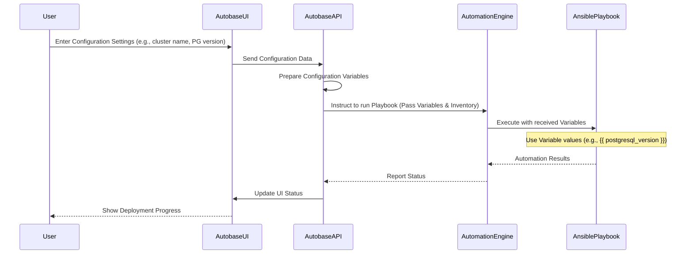

# Chapter 5: Configuration Variables

Welcome back! In our journey through Autobase, we've seen the [Autobase Console](01_autobase_console__ui___api__.md) as the control center ([Chapter 1](01_autobase_console__ui___api__.md)), [Ansible Automation](02_ansible_automation_.md) as the skilled crew doing the actual work on your servers ([Chapter 2](02_ansible_automation_.md)), [Patroni](03_patroni_.md) ensuring your database is highly available ([Chapter 3](03_patroni_.md)), and the [Distributed Consensus Store (DCS)](04_distributed_consensus_store__dcs__.md) helping Patroni coordinate safely ([Chapter 4](04_distributed_consensus_store__dcs__.md)).

All these powerful components need to be configured. Not every database cluster is the same! You might need a different PostgreSQL version, a unique cluster name, specific network settings, or different backup configurations.

## The Problem: One Size Doesn't Fit All

If the [Ansible Playbooks](06_ansible_playbooks_.md) and [Roles](07_ansible_roles_.md) that Autobase uses had every setting hardcoded, we'd need a completely different set of automation scripts for every slightly different database deployment. That would be a maintenance nightmare! We need a way to tell the automation *how* we want things configured *this time*, without changing the core automation logic itself.

## What are Configuration Variables?

Think of **Configuration Variables** as the "settings knobs" or "ingredients list" for your database deployment recipe. They are named values that allow you to customize the behavior of the [Ansible Automation](02_ansible_automation_.md) when it runs.

Instead of the automation script saying, "Always install PostgreSQL version 15," it uses a variable like `postgresql_version`. You then provide the value for this variable (e.g., `16`, `17`, or `15`) for your specific deployment.

These variables control almost everything about your database cluster setup, such as:

*   The name of your cluster (`patroni_cluster_name`)
*   Which PostgreSQL version to install (`postgresql_version`)
*   Details for connecting to your cloud provider (e.g., server types, regions)
*   Network ports (`postgresql_port`, `patroni_restapi_port`, `pgbouncer_listen_port`)
*   Whether to install optional components like PgBouncer or specific backup tools (`pgbouncer_install`, `wal_g_install`, `pgbackrest_install`)
*   Users, passwords, and databases to create (`postgresql_users`, `postgresql_databases`)
*   PostgreSQL configuration settings (`postgresql_parameters`)
*   And much, much more!

## How Autobase Uses Configuration Variables

When you use the [Autobase Console UI](01_autobase_console__ui___api__.md) (or API) to launch or manage a cluster, you're essentially filling out a form or providing a structured set of data that defines your desired configuration.

The [Autobase API](01_autobase_console__ui___api_.md) takes this configuration data and turns it into **variables** that it passes to the [Ansible Automation Engine](02_ansible_automation_.md) when it tells Ansible to run a specific [Playbook](06_ansible_playbooks_.md).

So, the flow looks something like this:

1.  You specify your desired settings (like cluster name, PG version) in the **Autobase Console UI**.
2.  The **Autobase UI** sends these settings to the **Autobase API**.
3.  The **Autobase API** packages these settings as **Configuration Variables**.
4.  The **Autobase API** tells the **Ansible Automation Engine** (the Docker container) to run an [Ansible Playbook](06_ansible_playbooks_.md), providing the Inventory (list of servers) and the **Configuration Variables**.
5.  The **Ansible Automation Engine** executes the [Playbook](06_ansible_playbooks_.md), using the values from the **Configuration Variables** to customize tasks like generating configuration files, installing specific package versions, setting up users, etc.

Here's a simplified sequence:



This shows that the Configuration Variables are the bridge between your high-level requirements specified in the Console and the detailed steps performed by Ansible.

## Where Do These Variables Live? (Under the Hood)

In Ansible, variables can be defined in several places. Autobase primarily uses two:

1.  **Defaults Files (`defaults/main.yml`):** Each [Ansible Role](07_ansible_roles_.md) has a `defaults` directory, and inside it, a `main.yml` file. This is where the *default* value for each variable used by that role is defined. This is useful because if you don't specify a variable's value, Ansible will use the default. It also acts as documentation for what settings are available for that role.
2.  **Passed by the API:** The values you provide through the [Autobase Console](01_autobase_console__ui___api__.md) are collected by the [Autobase API](01_autobase_console__ui___api_.md) and passed directly to the Ansible execution command. These values have higher **precedence** than the defaults, meaning they override anything set in `defaults/main.yml`.

Let's look at a small example from the `automation/roles/common/defaults/main.yml` file:

```yaml
# automation/roles/common/defaults/main.yml (Simplified Snippet)
---
# Main cluster variables
############################################################

patroni_cluster_name: "postgres-cluster" # the cluster name (must be unique for each cluster)

patroni_superuser_username: "postgres"
patroni_superuser_password: "" # Please specify a password. If not defined, will be generated automatically during deployment.

# ... many other variables ...

############################################################
# PostgreSQL parameters
############################################################

postgresql_version: 17
postgresql_listen_addr: "0.0.0.0" # Listen on all interfaces. Or use "{{ inventory_hostname }},127.0.0.1" to listen on a specific IP address.
postgresql_port: 5432

# ... more postgres variables ...

# PgBouncer parameters
############################################################

pgbouncer_install: true # or 'false' if you do not want to install and configure the pgbouncer service
pgbouncer_listen_port: 6432

# ... more pgbouncer variables ...
```
This snippet shows some of the default values for variables like `patroni_cluster_name`, `postgresql_version`, and `pgbouncer_install`.

Now, let's see how these variables are used inside an Ansible template file (a file with a `.j2` extension, meaning it's a Jinja2 template, used to generate configuration files on the servers). Ansible fills in the `{{ variable_name }}` placeholders with the actual values.

Imagine a simplified Patroni configuration file template:

```yaml
# automation/roles/patroni/templates/patroni.yml.j2 (Simplified Snippet)
scope: {{ patroni_cluster_name }} # Use the cluster name variable
namespace: /service

postgresql:
  listen: {{ postgresql_listen_addr }}:{{ postgresql_port }} # Use PG address and port variables
  data_dir: {{ postgresql_data_dir }} # Use PG data directory variable
  authentication:
    replication:
      username: {{ patroni_replication_username }}
      password: {{ patroni_replication_password }}
    superuser:
      username: {{ patroni_superuser_username }}
      password: {{ patroni_superuser_password }}

# Configure DCS based on dcs_type variable

etcd3:
  hosts: {{ patroni_etcd_hosts | to_json }} # Use variable for ETCD hosts
  protocol: {{ patroni_etcd_protocol }}

consul:
  host: 127.0.0.1:8500 # Assuming Consul agent runs locally
  url: http://127.0.0.1:8500 # Or use specific variables if needed


# ... more Patroni configuration using variables ...
```
When Ansible processes this template for a specific server, it looks up the values for `patroni_cluster_name`, `postgresql_listen_addr`, `postgresql_port`, etc., from the variables provided by the [Autobase API](01_autobase_console__ui___api_.md) (or the defaults if not provided) and generates the final `patroni.yml` file on the server with the correct values filled in. The `` blocks show how variables can even control which sections of the configuration are included.

This is a core pattern in Ansible: defining configurations using templates and variables, allowing the same automation code to produce different results based on the input variables.

## Finding Available Configuration Variables

The best place to discover all the possible configuration variables and their default values is within the `defaults/main.yml` files of the [Ansible Roles](07_ansible_roles_.md).

*   Look at `automation/roles/common/defaults/main.yml`: This file contains many fundamental variables applicable to the entire cluster setup (cluster names, key users/passwords, ports, DCS settings, basic PostgreSQL and PgBouncer settings, network settings, etc.).
*   Look at other roles like `automation/roles/postgresql/defaults/main.yml` for PostgreSQL-specific settings, `automation/roles/pgbouncer/defaults/main.yml` for more PgBouncer details, `automation/roles/wal_g/defaults/main.yml` or `automation/roles/pgbackrest/defaults/main.yml` for backup configurations, etc.

These files serve as a comprehensive reference for what you can customize. The [Autobase Console UI](01_autobase_console__ui___api__.md) is designed to expose the most commonly used and important of these variables through its forms.

## Conclusion

Configuration Variables are fundamental to making Autobase flexible and reusable. They separate the "how" (the automation logic in [Playbooks](06_ansible_playbooks_.md) and [Roles](07_ansible_roles_.md)) from the "what" (the specific settings for a deployment). By defining these variables, you can customize your PostgreSQL clusters without needing to write or modify Ansible code directly. The [Autobase Console](01_autobase_console__ui___api__.md) collects your requirements and passes them as these variables to the [Ansible Automation Engine](02_ansible_automation_.md), which uses them to generate tailored configurations and perform actions on your servers.

You now understand the role of variables and where the automation finds the settings it needs. In the next chapter, we'll zoom out to look at [Ansible Playbooks](06_ansible_playbooks_.md) – the top-level scripts that orchestrate the use of these variables and roles to perform complex tasks like deploying an entire cluster.

[Next Chapter: Ansible Playbooks](06_ansible_playbooks_.md)

---

<sub><sup>Generated by [AI Codebase Knowledge Builder](https://github.com/The-Pocket/Tutorial-Codebase-Knowledge).</sup></sub> <sub><sup>**References**: [[1]](https://github.com/vitabaks/autobase/blob/190aaf8616fc3f12dae58cdb3731af69f97ff013/automation/molecule/tests/roles/pre-checks/variables/pgbouncer.yml), [[2]](https://github.com/vitabaks/autobase/blob/190aaf8616fc3f12dae58cdb3731af69f97ff013/automation/molecule/tests/variables/asserts/apt_repository.yml), [[3]](https://github.com/vitabaks/autobase/blob/190aaf8616fc3f12dae58cdb3731af69f97ff013/automation/roles/cloud_resources/defaults/main.yml), [[4]](https://github.com/vitabaks/autobase/blob/190aaf8616fc3f12dae58cdb3731af69f97ff013/automation/roles/common/defaults/main.yml), [[5]](https://github.com/vitabaks/autobase/blob/190aaf8616fc3f12dae58cdb3731af69f97ff013/automation/roles/upgrade/defaults/main.yml)</sup></sub>
