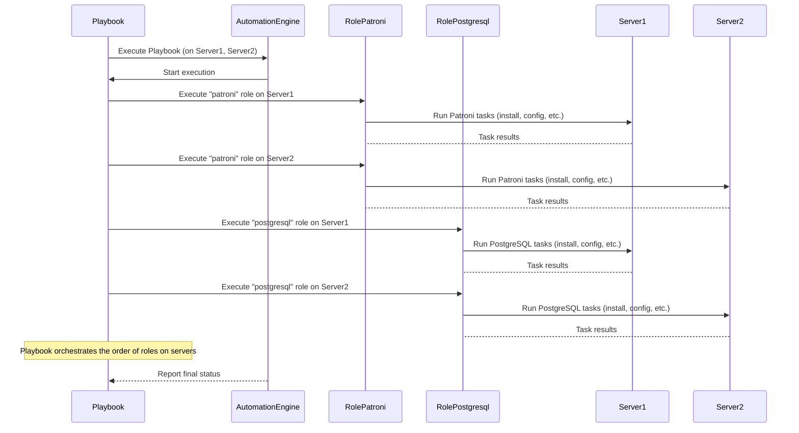

# Chapter 7: Ansible Roles

Welcome back! In our last chapter, [Chapter 6: Ansible Playbooks](06_ansible_playbooks_.md), we saw that Playbooks are the master plans that orchestrate complex automation tasks, like deploying an entire PostgreSQL cluster. They tell Ansible *what* to do and *where* to do it.

However, if you looked closely at the `deploy_pgcluster.yml` playbook, you'd notice that instead of listing every single step directly, it primarily listed **Roles**. Why is that?

## The Problem: Keeping Automation Organized and Reusable

Imagine our [Ansible Automation](02_ansible_automation_.md) crew has many different jobs: setting up the firewall, installing PostgreSQL, configuring [Patroni](03_patroni_.md), adding users, etc. If the `deploy_pgcluster.yml` playbook contained *all* the instructions for *all* these jobs directly within its tasks, it would become incredibly long, complicated, and hard to read.

Even worse, what if another playbook, say `add_pgnode.yml`, also needs to install PostgreSQL and configure Patroni on a new server? We'd have to copy and paste all those installation and configuration steps from `deploy_pgcluster.yml` into `add_pgnode.yml`. This is inefficient and makes updating things difficult – if the PostgreSQL installation process changes, you have to update it in multiple places.

We need a way to bundle related tasks together into reusable, self-contained units.

## What are Ansible Roles?

**Ansible Roles** are like self-contained **toolkits** or **modules** for a specific job. Each Role is a structured directory that contains all the necessary pieces of automation for a single concept, such as "configure the firewall", "install PostgreSQL", or "set up Patroni".

A typical Ansible Role directory structure looks something like this:

```
rolename/
├── tasks/
│   └── main.yml       # The main list of tasks to execute for this role
├── handlers/
│   └── main.yml     # Tasks that only run when 'notified' by other tasks
├── defaults/
│   └── main.yml     # Default variables for this role (lowest precedence)
├── vars/
│   └── main.yml       # Other variables for this role (higher precedence than defaults)
├── files/
│   └── some_static_file # Static files to copy to target servers
├── templates/
│   └── some_config.conf.j2 # Template files (Jinja2) to generate config files
└── meta/
    └── main.yml       # Metadata about the role, including dependencies
```

When a Playbook calls a Role, Ansible automatically looks for and executes the tasks defined in `rolename/tasks/main.yml`. It also makes the variables defined in `defaults/` and `vars/` available, and allows tasks to use files and templates from the `files/` and `templates/` directories within the role.

Key benefits of using Roles:

*   **Organization:** Keeps related tasks, variables, and files together.
*   **Reusability:** The same Role can be used in multiple different Playbooks.
*   **Shareability:** Roles can be easily shared and reused across different projects or even downloaded from Ansible Galaxy.
*   **Maintainability:** Changes to a specific job (like Patroni configuration) only need to be made within that Role's directory.

## How Autobase Uses Roles

Autobase extensively uses Roles to build its automation logic. The [Ansible Playbooks](06_ansible_playbooks_.md) in the `automation/playbooks/` directory don't contain complex task lists themselves. Instead, they act as orchestrators, simply listing which Roles to apply to which group of servers.

For instance, the `deploy_pgcluster.yml` playbook we saw in the last chapter includes lines like:

```yaml
# automation/playbooks/deploy_pgcluster.yml (Snippet)
# ... other plays ...

- name: vitabaks.autobase.deploy_pgcluster | PostgreSQL Cluster Deployment
  hosts: postgres_cluster # Run tasks on servers in the 'postgres_cluster' group
  become: true
  # ... other settings ...

  roles:
    - role: vitabaks.autobase.wal_g
      when: wal_g_install | default(false) | bool
    - role: vitabaks.autobase.cron
    - role: vitabaks.autobase.pgbouncer # Calls the pgbouncer Role
      when: pgbouncer_install | default(false) | bool
    - role: vitabaks.autobase.patroni # Calls the patroni Role (!!!)
    - role: vitabaks.autobase.vip_manager
      when: not with_haproxy_load_balancing | default(false) | bool and
        (cluster_vip is defined and cluster_vip | length > 0)
    # ... other roles ...
```
This snippet from the playbook shows how it uses the `roles:` keyword to simply list the names of the roles it needs to execute on the `postgres_cluster` hosts. It doesn't need to know the hundreds of individual tasks within the `patroni` or `pgbouncer` roles; it just says "run the Patroni setup" and "run the PgBouncer setup". The `when:` conditions allow skipping roles if certain features are not enabled by the [Configuration Variables](05_configuration_variables_.md).

## Inside the `patroni` Role

Let's take the `patroni` role as a concrete example. As discussed in [Chapter 3: Patroni](03_patroni_.md), setting up Patroni involves several steps: installing the software, creating configuration files, setting up the system service, etc. All these related tasks are bundled together in the `automation/roles/patroni/` directory.

The core logic for the `patroni` role is in `automation/roles/patroni/tasks/main.yml`. It contains a series of individual tasks using various Ansible modules.

Here's a super simplified look at some tasks you might find there:

```yaml
# automation/roles/patroni/tasks/main.yml (Simplified Snippet)

- name: Ensure Python3 and Pip are installed (required by Patroni)
  ansible.builtin.package:
    name:
      - python3
      - python3-pip
    state: present
  become: true # Needs root privileges to install packages

- name: Install patroni via pip
  ansible.builtin.pip:
    name: patroni
    state: present # or 'latest'
    executable: pip3
  become: true

- name: Create Patroni configuration directory
  ansible.builtin.file:
    path: /etc/patroni
    state: directory
    owner: postgres
    group: postgres
    mode: '0750'
  become: true

- name: Generate patroni.yml configuration file from template
  ansible.builtin.template:
    src: templates/patroni.yml.j2 # Looks for patroni.yml.j2 in the role's templates/ dir
    dest: /etc/patroni/patroni.yml
    owner: postgres
    group: postgres
    mode: '0640'
  become: true
  # This task would use variables from defaults/ or passed to the Playbook
  # to fill in the template. Example: {{ patroni_cluster_name }}

- name: Set up Patroni systemd service file from template
  ansible.builtin.template:
    src: templates/patroni.service.j2 # Looks for patroni.service.j2
    dest: /etc/systemd/system/patroni.service
    owner: root
    group: root
    mode: '0644'
  become: true
  notify: Restart patroni service # Triggers a handler later if this file changes

- name: Start and enable Patroni service
  ansible.builtin.systemd:
    daemon_reload: true # Reload systemd config to find new service file
    name: patroni
    state: started
    enabled: true
  become: true
```
This snippet shows individual tasks using modules like `package`, `pip`, `file`, `template`, and `systemd`. All these tasks work together to achieve the goal of "setting up Patroni". Notice how the `template` tasks refer to files within the role's `templates/` directory (`patroni.yml.j2`, `patroni.service.j2`). These template files use [Configuration Variables](05_configuration_variables_.md) (which might have default values defined in `roles/patroni/defaults/main.yml` or `roles/common/defaults/main.yml`) to generate the final configuration files specific to your cluster.

The `meta/main.yml` file in the `patroni` role might declare a dependency on the `common` role:

```yaml
# automation/roles/patroni/meta/main.yml (Snippet)
dependencies:
  - role: vitabaks.autobase.common # The common role provides shared defaults/vars
```
This means whenever the `patroni` role is used, Ansible will automatically make sure the `common` role's variables and potentially tasks are considered first, providing those shared [Configuration Variables](05_configuration_variables_.md) and common setup tasks.

## Visualizing Playbooks Using Roles

Here's how a Playbook uses Roles conceptually:


This diagram shows that the Playbook doesn't talk directly to the server about specific steps. Instead, it delegates blocks of work by telling the Automation Engine to execute specific Roles on specific servers or groups. The Role then contains the detailed instructions (tasks) for performing its job on the target server(s).

## Finding Autobase Roles

All the custom Ansible Roles used by Autobase are located in the `automation/roles/` directory in the project repository.

You'll find roles for:

*   `common`: Shared variables and common tasks.
*   `patroni`: Installing and configuring Patroni.
*   `postgresql`: Installing and configuring PostgreSQL.
*   `etcd` or `consul`: Installing and configuring the DCS.
*   `pgbouncer`: Installing and configuring PgBouncer.
*   `pgbackrest` and `wal_g`: Configuring backup solutions.
*   `firewall`: Managing firewall rules.
*   `users`: Creating PostgreSQL users and databases.
*   And many more for various system configurations and tools.

Each role's directory usually contains a `README.md` file that provides a brief description of its purpose.

## Conclusion

Ansible Roles are the essential building blocks of Autobase's automation. They provide organization, reusability, and maintainability by bundling related tasks, variables, and files for specific jobs like installing software or configuring components. Playbooks orchestrate these Roles to perform larger operations like deploying an entire cluster.

You now understand that Playbooks call upon Roles, and Roles contain the detailed steps to perform specific jobs on your servers using [Configuration Variables](05_configuration_variables_.md). This modular approach makes the Autobase automation codebase much easier to understand, manage, and extend.

One significant benefit of this modular role-based approach is that it makes testing individual components much simpler. In the next chapter, we'll explore **Molecule Testing**, a tool used in Autobase to automatically test these individual Roles.

[Next Chapter: Molecule Testing](08_molecule_testing_.md)

---

<sub><sup>Generated by [AI Codebase Knowledge Builder](https://github.com/The-Pocket/Tutorial-Codebase-Knowledge).</sup></sub> <sub><sup>**References**: [[1]](https://github.com/vitabaks/autobase/blob/190aaf8616fc3f12dae58cdb3731af69f97ff013/automation/README.md), [[2]](https://github.com/vitabaks/autobase/blob/190aaf8616fc3f12dae58cdb3731af69f97ff013/automation/roles/common/README.md), [[3]](https://github.com/vitabaks/autobase/blob/190aaf8616fc3f12dae58cdb3731af69f97ff013/automation/roles/haproxy/README.md), [[4]](https://github.com/vitabaks/autobase/blob/190aaf8616fc3f12dae58cdb3731af69f97ff013/automation/roles/patroni/README.md), [[5]](https://github.com/vitabaks/autobase/blob/190aaf8616fc3f12dae58cdb3731af69f97ff013/automation/roles/pre_checks/README.md)</sup></sub>
