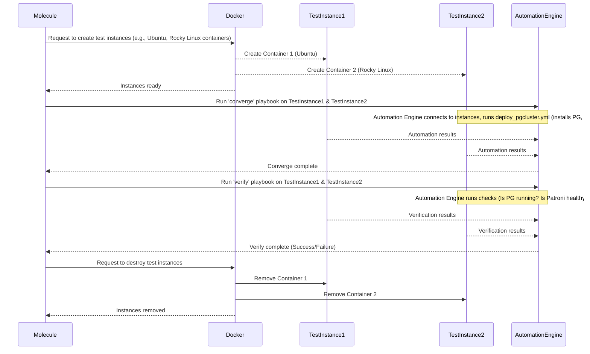

# Chapter 8: Molecule Testing

Welcome back! In our previous chapters, we've explored the building blocks of Autobase's automation: [Ansible Playbooks](06_ansible_playbooks_.md) as the master plans and [Ansible Roles](07_ansible_roles_.md) as the reusable toolkits that perform specific jobs like installing PostgreSQL or configuring [Patroni](03_patroni_.md).

These Ansible roles and playbooks are powerful because they automate complex setup processes across different servers and various Linux distributions. But how can we be sure they *actually work correctly* every time, on every supported system?

## The Problem: Ensuring Automation Reliability

Imagine you've written an Ansible role to install and configure PostgreSQL. It works perfectly on your local testing server running Ubuntu. But will it work just as well on a server running Rocky Linux? What about a different version of Ubuntu? What if you change a tiny detail in the role?

Manually testing every change on every supported operating system is time-consuming, tedious, and error-prone. You need a way to automatically and reliably test your automation code in isolated environments that mimic the real servers.

## What is Molecule Testing?

**Molecule is the project's testing laboratory for the Ansible automation.** It's a tool specifically designed to help you test your Ansible roles and playbooks.

Think of Molecule as setting up a temporary, miniature version of your server environment *just* for testing. Inside this test lab, Molecule performs a sequence of steps:

1.  **Create:** It creates one or more test instances (often lightweight containers using Docker). Each instance can run a different operating system (like Ubuntu, Debian, Rocky Linux, AlmaLinux).
2.  **Prepare (Optional):** It might run some initial setup on the test instances (e.g., installing Python).
3.  **Converge:** This is the core step. Molecule runs your specified Ansible Playbook or Role on the newly created test instances. This is where your automation code actually does its work within the isolated environment.
4.  **Idempotence (Optional):** It runs the "Converge" step again to ensure your automation is **idempotent** – meaning running it multiple times has the same result as running it once. If a task changes something the second time, it indicates a potential issue in the automation logic.
5.  **Verify:** This is where the test checks if the automation *did what it was supposed to*. It runs a separate set of tests (usually written as Ansible tasks or even simple scripts) on the test instances to confirm the desired state has been achieved (e.g., "Is PostgreSQL running?", "Does the configuration file contain this line?", "Is Patroni reporting the correct status?").
6.  **Destroy:** Molecule cleans up and removes the temporary test instances.

This workflow ensures that your Ansible automation is tested in realistic, isolated environments, catching potential bugs or compatibility issues early in the development cycle.

## Key Concepts in Molecule

Let's break down a few core ideas you'll encounter in Molecule:

| Concept      | Description                                                                                                |
| :----------- | :--------------------------------------------------------------------------------------------------------- |
| **Scenario** | A specific test configuration. A role might have a `default` scenario, a `cluster` scenario, etc. Defines the test sequence and settings. |
| **Driver**   | The technology used to create the test instances (e.g., `docker`, `vagrant`). Autobase uses the `docker` driver. |
| **Platform** | A specific test instance definition (e.g., a Docker image for 'ubuntu2204'). You define multiple platforms to test different OSes. |
| **Converge** | The Molecule step where your Ansible role/playbook is executed on the test instances.                      |
| **Verify**   | The Molecule step where tests are run on the instances to check the outcome of the `converge` step.          |
| **Destroy**  | The Molecule step that tears down and removes the test instances after testing is complete.                |

These concepts are defined in configuration files, typically within a `molecule/` directory inside the Ansible role or collection being tested.

## How Autobase Uses Molecule

In the Autobase project, Molecule is primarily used to test the **Ansible Roles** located in the `automation/roles/` directory. However, for its main `default` scenario, it takes a broader approach and tests the core `deploy_pgcluster.yml` playbook itself, but running it against test instances created by Molecule. This allows testing how the different roles interact within a full deployment context, still within isolated environments.

Autobase's Molecule tests ensure that:

*   The core [Ansible Playbooks](06_ansible_playbooks_.md) like `deploy_pgcluster.yml` can be run successfully.
*   The individual [Ansible Roles](07_ansible_roles_.md) used within those playbooks work correctly (e.g., the `patroni` role installs Patroni, the `postgresql` role installs PostgreSQL).
*   The automation works as expected on different supported Linux distributions (Ubuntu, Debian, Rocky Linux, AlmaLinux, etc.).
*   Configuration files are generated correctly based on test [Configuration Variables](05_configuration_variables_.md).
*   Services ([Patroni](03_patroni_.md), PostgreSQL, [DCS](04_distributed_consensus_store__dcs__.md) like etcd/Consul) start and are healthy.

## The Molecule Workflow in Autobase (Simplified)

Let's visualize the core Molecule steps for the default scenario:



This diagram shows how Molecule uses Docker to create temporary servers, runs the main automation playbook on them via the Automation Engine, verifies the results, and cleans up.

## Inside Autobase's Molecule Configuration

The configuration for Molecule in Autobase lives primarily under the `automation/molecule/default/` directory.

*   `automation/molecule/default/molecule.yml`: Defines the scenario, driver, and platforms.
*   `automation/molecule/default/converge.yml`: The Ansible playbook that Molecule runs during the `converge` step.
*   `automation/molecule/default/verify.yml`: The Ansible playbook that Molecule runs during the `verify` step, containing the tests.

Let's look at snippets from these files.

**`molecule.yml` (Defining Platforms):**

This file defines the test environments (platforms) that Molecule will create.

```yaml
# automation/molecule/default/molecule.yml (Snippet)
platforms:
  - name: 10.172.0.20
    hostname: pgnode01
    image: "${IMAGE_NAMESPACE:-geerlingguy}/docker-${IMAGE_DISTRO:-ubuntu2204}-ansible:${IMAGE_TAG:-latest}"
    networks:
      - name: test_docker_network
        ipv4_address: 10.172.0.20
    exposed_ports:
      - 22/tcp
      - 2379/tcp # if dcs_type: "etcd"
      # ... more ports ...
    groups:
      - etcd_cluster # if dcs_type: "etcd"
      - consul_instances # if dcs_type: "consul"
      - master
      - postgres_cluster
      - balancers

  - name: 10.172.0.21
    hostname: pgnode02
    image: "${IMAGE_NAMESPACE:-geerlingguy}/docker-${IMAGE_DISTRO:-ubuntu2204}-ansible:${IMAGE_TAG:-latest}"
    networks:
      - name: test_docker_network
        ipv4_address: 10.172.0.21
    exposed_ports:
      - 22/tcp
      # ... more ports ...
    groups:
      - etcd_cluster
      - consul_instances
      - replica
      - postgres_cluster
      - balancers

  # ... definition for pgnode03 (similar) ...
```
This snippet shows the definition for two test instances (`pgnode01` and `pgnode02`).
*   `image`: Specifies the Docker image to use (e.g., a `geerlingguy` image for Ubuntu or Rocky Linux, determined by variables like `IMAGE_DISTRO` which can be passed during the test run).
*   `networks`: Configures a dedicated Docker network for the test instances.
*   `exposed_ports`: Lists ports that should be accessible.
*   `groups`: **Important!** These instances are assigned to Ansible groups (`master`, `replica`, `postgres_cluster`, `etcd_cluster`, etc.). This mimics the structure of a real [Inventory](02_ansible_automation_.md) and allows the `converge` playbook to target specific groups of test instances, just like it would target real servers.

**`converge.yml` (Running the Automation):**

This is the playbook run by Molecule on the test instances. It essentially runs the main deployment playbook.

```yaml
# automation/molecule/default/converge.yml (Snippet)
    - name: Set variables for PostgreSQL Cluster deployment test
      ansible.builtin.set_fact:
        # ... other variables ...
        dcs_type: "{{ ['etcd', 'consul'] | random }}" # Set 'dcs_type' randomly for testing
        # ... more variables ...
      delegate_to: localhost
      run_once: true

    # ... check and set variables for specific distros ...

- name: Deploy PostgreSQL Cluster test
  ansible.builtin.import_playbook: ../../playbooks/deploy_pgcluster.yml # Import the main deployment playbook
```
This shows how `converge.yml` first sets up some variables for the test scenario (including randomly choosing `etcd` or `consul` as the [DCS](04_distributed_consensus_store__dcs__.md) type to test both). Then, it imports and runs the main `deploy_pgcluster.yml` playbook. This playbook, in turn, uses the defined [Ansible Roles](07_ansible_roles_.md) to install and configure PostgreSQL, Patroni, the chosen DCS, etc., on the test instances defined in `molecule.yml`.

**`verify.yml` (Checking the Results):**

This playbook runs after `converge` and contains the checks to see if the automation worked.

```yaml
# automation/molecule/default/verify.yml (Snippet)
- name: Molecule.default.verify
  hosts: all # Run verification tasks on all test instances
  gather_facts: true

  tasks:
    # ... include necessary variables ...

    # 🔄 Including all tests for the Molecule default configuration
    - name: Molecule.default.verify | Include All Tests
      ansible.builtin.include_tasks: "{{ item }}"
      with_fileglob:
        # Include test tasks from specific directories
        - ../tests/etcd/*.yml
        - ../tests/patroni/*.yml
        - ../tests/postgres/*.yml
        # ... include test tasks for other roles ...
```
This shows that `verify.yml` runs tasks on `all` test instances. It includes tasks from separate test files (e.g., `../tests/etcd/*.yml`, `../tests/patroni/*.yml`). These files contain the actual checks.

Let's look at a snippet from a test file for `etcd`:

```yaml
# automation/molecule/tests/etcd/etcd.yml (Snippet)
- name: Check etcd health
  ansible.builtin.uri:
    url: "{{ patroni_etcd_protocol | default('http', true) }}://{{ inventory_hostname }}:2379/health"
    method: GET
    return_content: true
    # ... TLS verification parameters using variables ...
  register: etcd_health_status # Store the result
  failed_when: "(etcd_health_status.content | from_json).health != 'true'" # Fail if health is not 'true'
  vars:
    # ... variables for TLS paths ...
  when: dcs_type == "etcd" # Only run this check if etcd was deployed
```
This task, included by `verify.yml`, uses the `uri` module to make an HTTP request to the `etcd` health check endpoint on the test instance. It registers the response and uses `failed_when` to assert that the `health` status returned by etcd is indeed `true`. If it's not, the test fails, indicating a problem with the etcd deployment handled by the automation. Similar tests exist for Patroni (checking its status API), PostgreSQL (checking if it's running and configured), etc.

## Running Molecule Tests

You typically don't run Molecule commands directly. Autobase uses a `Makefile` ([Chapter 10](10_makefile_.md)) to simplify running tests. The main command is often something like:

```bash
make molecule-test
```

This command triggers Molecule to run the full test sequence (create, converge, verify, destroy) for the default scenario on a predefined set of platforms (different Docker images representing various Linux distributions).

Furthermore, these Molecule tests are integrated into the project's Continuous Integration (CI) workflow ([Chapter 9](09_ci_workflows_.md)). Every time code is pushed or a pull request is opened, the CI system automatically runs these Molecule tests on different operating systems to ensure the changes haven't introduced regressions. You can see the status badges for these tests in the project's `README.md`.

## Conclusion

Molecule is a vital tool in the Autobase project, serving as the automated testing ground for its Ansible automation. By creating temporary, isolated environments (typically Docker containers), running the automation on them (`converge`), and then checking the results (`verify`), Molecule ensures that Autobase's [Ansible Roles](07_ansible_roles_.md) and [Playbooks](06_ansible_playbooks_.md) are reliable and work consistently across various supported Linux distributions. This automated testing is crucial for maintaining the quality and stability of the project.

You've learned what Molecule is, its key concepts, how Autobase uses it to test its automation, and how verification checks ensure the desired state is achieved. In the next chapter, we'll look at **CI Workflows**, which explain how these automated tests, including Molecule tests, are run automatically as part of the project's development process.

[Next Chapter: CI Workflows](09_ci_workflows_.md)

---

<sub><sup>Generated by [AI Codebase Knowledge Builder](https://github.com/The-Pocket/Tutorial-Codebase-Knowledge).</sup></sub> <sub><sup>**References**: [[1]](https://github.com/vitabaks/autobase/blob/190aaf8616fc3f12dae58cdb3731af69f97ff013/.config/molecule/config.yml), [[2]](https://github.com/vitabaks/autobase/blob/190aaf8616fc3f12dae58cdb3731af69f97ff013/.github/workflows/molecule.yml), [[3]](https://github.com/vitabaks/autobase/blob/190aaf8616fc3f12dae58cdb3731af69f97ff013/README.md), [[4]](https://github.com/vitabaks/autobase/blob/190aaf8616fc3f12dae58cdb3731af69f97ff013/automation/molecule/default/molecule.yml), [[5]](https://github.com/vitabaks/autobase/blob/190aaf8616fc3f12dae58cdb3731af69f97ff013/automation/molecule/default/verify.yml), [[6]](https://github.com/vitabaks/autobase/blob/190aaf8616fc3f12dae58cdb3731af69f97ff013/automation/molecule/tests/etcd/etcd.yml)</sup></sub>
