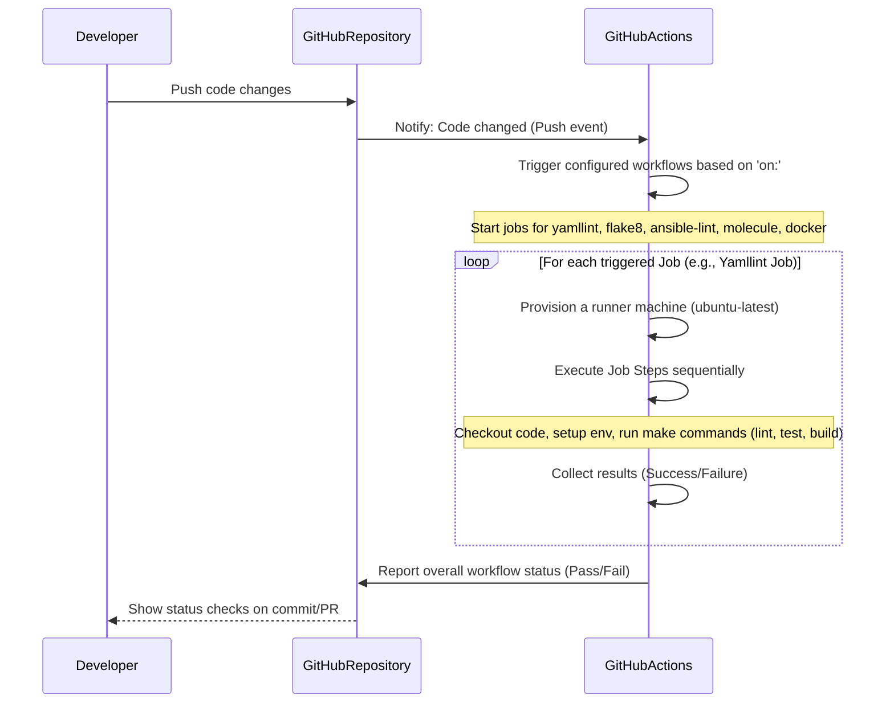

# Chapter 9: CI Workflows

Welcome back! In our [previous chapter](08_molecule_testing_.md), we learned about Molecule, the fantastic tool Autobase uses to automatically test its [Ansible Roles](07_ansible_roles_.md) and [Playbooks](06_ansible_playbooks_.md) in isolated environments. Molecule helps ensure that the core automation logic works correctly on different operating systems.

But Molecule is just one type of check. Before code is merged into the main project, it's also important to check for code style issues, build the project's components (like Docker images), and run other kinds of tests. Doing all these checks manually every time someone makes a change is tedious and easy to forget. It slows down development and can lead to broken code making its way into the project.

## The Problem: Manual Quality Control is Slow and Unreliable

Imagine the process for contributing code:

1.  Write some code or update an [Ansible Role](07_ansible_roles_.md).
2.  Manually run a linter to check code style.
3.  Manually run a command to build the Docker images.
4.  Manually run Molecule tests for the affected role or playbook on a few systems.
5.  If everything passes, submit the change.

This process relies on the human developer remembering and correctly executing *all* the necessary checks every time. If they miss one, a bug or a style violation might get into the codebase. This is especially true in a project with multiple contributors.

We need a system that automatically performs these quality control checks whenever code is changed, providing fast feedback and acting as a safety net.

## What are CI Workflows?

CI stands for **Continuous Integration**. The idea is to integrate code changes frequently and automatically check that the integrated code is still working correctly.

**CI Workflows** are the automated pipelines that perform these checks. In the Autobase project, these workflows are powered by **GitHub Actions**.

Think of CI Workflows as the project's automated quality control system or an always-awake code reviewer. Every time code is updated in the project repository (like when a pull request is opened or code is pushed to the main branch), these workflows automatically trigger and run a predefined set of checks.

These checks can include:

1.  **Code Linting:** Checking the code for style consistency, common errors, and potential bugs (e.g., using tools like Flake8 for Python or Ansible-lint for Ansible code).
2.  **Building:** Compiling code, building Docker images, or creating other necessary artifacts.
3.  **Testing:** Running automated tests, including the [Molecule Tests](08_molecule_testing_.md) we discussed.

If any step in a workflow fails (e.g., a linter finds a style error, a test fails, or a Docker image build breaks), the workflow run is marked as failed. This immediately flags the issue, often right on the pull request, so developers know there's a problem that needs fixing before the code can be merged.

This helps maintain high code quality, prevents regressions (new changes breaking old functionality), and ensures that the project's build artifacts (like Docker images) are always functional.

## How Autobase Uses GitHub Actions for CI

Autobase uses GitHub Actions because it's integrated directly into the GitHub platform where the project code is hosted.

The configuration for these automated workflows lives in the `.github/workflows/` directory at the root of the project. Each file in this directory defines a separate workflow.

Let's look at the main workflows used by Autobase, based on the provided files:

*   **`ansible-lint.yml`:** Runs `ansible-lint` to check Ansible code for style and best practices.
*   **`docker.yml`:** Builds and potentially pushes the project's Docker images (like the `autobase/automation` image).
*   **`flake8.yml`:** Runs `flake8` to check Python code for style and errors.
*   **`molecule.yml`:** Runs the [Molecule Tests](08_molecule_testing_.md) across different defined platforms.
*   **`yamllint.yml`:** Runs `yamllint` to check YAML file syntax and style.

Each of these files tells GitHub Actions:
*   **When to run:** (e.g., on every `push` to `master` and every `pull_request` targeting `master`).
*   **What to run on:** (e.g., using a standard `ubuntu-latest` virtual machine provided by GitHub).
*   **What steps to perform:** (e.g., checkout the code, set up Python, install dependencies, run the specific linting or testing command).

## Looking Inside a Workflow File

Let's examine a simplified snippet from one of the workflow files, like `yamllint.yml`, to see how it's structured:

```yaml
# .github/workflows/yamllint.yml (Simplified Snippet)
---
name: "Yamllint" # The name of the workflow shown in GitHub

on: # Defines when the workflow runs
  push:
    branches:
      - master # Run on pushes to the master branch
  pull_request:
    branches:
      - master # Run on pull requests targeting the master branch

jobs: # Defines the jobs that make up the workflow
  build: # A job named 'build'
    runs-on: ubuntu-latest # This job runs on a fresh Ubuntu virtual machine

    steps: # The sequence of steps within the 'build' job
      - name: Set TERM environment variable # Step 1: Give the step a name
        run: echo "TERM=xterm" >> $GITHUB_ENV # Execute a shell command

      - name: Checkout # Step 2: Checkout the code using a predefined action
        uses: actions/checkout@v4 # Use the 'checkout' action

      - name: Set up Python 3.12 # Step 3: Set up a specific Python version
        uses: actions/setup-python@v4
        with:
          python-version: "3.12" # Specify Python version

      - name: Install dependencies # Step 4: Install project dependencies
        run: make bootstrap-dev # Execute the 'bootstrap-dev' target from the Makefile

      - name: Run Yamllint # Step 5: Run the actual check
        run: make linter-yamllint # Execute the 'linter-yamllint' target from the Makefile
```

This snippet demonstrates the basic structure:
*   `name`: The human-readable name of the workflow.
*   `on`: Specifies the events that trigger the workflow (e.g., `push`, `pull_request`).
*   `jobs`: Contains one or more jobs. Workflows can have multiple jobs that might run in parallel or sequentially.
*   `job_name`: Each job has a name (e.g., `build`).
*   `runs-on`: Specifies the environment the job runs on.
*   `steps`: A list of individual commands or actions to be executed in order.
*   `name` (for a step): A descriptive name.
*   `run`: Executes a shell command.
*   `uses`: Executes a predefined GitHub Action (like checking out code or setting up a programming language).

Notice that many steps use `make` commands (e.g., `make bootstrap-dev`, `make linter-yamllint`). This shows how the CI workflows rely on the project's [Makefile](10_makefile_.md) to standardize command execution.

## The Molecule Workflow Snippet

Let's look at a key part of the `molecule.yml` workflow, where it defines testing across different Linux distributions using a matrix strategy:

```yaml
# .github/workflows/molecule.yml (Snippet)
---
name: Molecule # Workflow name

on: # Trigger conditions (same as others)
  push:
    branches:
      - master
  pull_request:
    branches:
      - master

jobs:
  test: # Job name
    runs-on: ubuntu-latest # Runs on Ubuntu runner
    strategy: # Defines a build matrix
      fail-fast: false # Don't cancel other matrix jobs if one fails
      matrix: # Define the combinations to test
        config: # A list of configurations
          - distro: debian12
            tag: latest
            namespace: geerlingguy
          - distro: ubuntu2404
            tag: latest
            namespace: geerlingguy
          - distro: rockylinux9
            tag: latest
            namespace: geerlingguy
          - distro: almalinux9
            tag: latest
            namespace: glillico

    steps:
      # ... (setup steps like checkout, python, install dependencies - similar to yamllint) ...

      - name: Run Molecule tests # The core test step
        run: make molecule-test # Execute the Molecule test command
        env: # Set environment variables for the make command
          PY_COLORS: "1"
          ANSIBLE_FORCE_COLOR: "1"
          IMAGE_DISTRO: ${{ matrix.config.distro }} # Pass distro from matrix
          IMAGE_TAG: ${{ matrix.config.tag }}       # Pass tag from matrix
          IMAGE_NAMESPACE: ${{ matrix.config.namespace }} # Pass namespace from matrix
```

This snippet shows:
*   `strategy.matrix`: This is crucial for testing on multiple platforms. It defines a set of variables (`distro`, `tag`, `namespace`) that will be combined.
*   GitHub Actions will create a separate job run for *each* item under `matrix.config`. So, there will be one job for `debian12`, one for `ubuntu2404`, etc., all running concurrently (unless `fail-fast` is true).
*   Inside the "Run Molecule tests" step, environment variables like `IMAGE_DISTRO` are set using `${{ matrix.config.distro }}`. These variables are then picked up by the `make molecule-test` command and passed down to Molecule, telling it which Docker image to use for that specific test run.

This setup ensures that the Molecule tests are automatically executed on a variety of supported Linux distributions whenever code changes, providing confidence that the automation works consistently.

## How the CI Workflow Executes (Simplified)

Here's a simple flow of how a typical CI workflow runs when you push code:



This diagram illustrates how GitHub Actions acts as the automated execution environment. When a configured event occurs (like a push), it triggers the specified workflows, runs each job's steps on temporary machines, and reports the results back to GitHub, which are then visible to the developer.

## Conclusion

CI Workflows, powered by GitHub Actions in the Autobase project, are the essential automated quality control layer. They automatically trigger and run various checks – including code linting, building Docker images, and executing comprehensive [Molecule Tests](08_molecule_testing_.md) – every time code changes. This automation catches issues early, ensures code quality, and provides rapid feedback, making the development process more reliable and efficient. By looking at the `.github/workflows/` directory, you can see exactly what checks are performed automatically.

You've learned what CI Workflows are, how GitHub Actions runs them, and how they use concepts like jobs, steps, and matrices to automate the project's quality checks, including running the [Molecule Tests](08_molecule_testing_.md) on different systems. You also saw how these workflows often call upon commands defined in the project's [Makefile](10_makefile_.md).

In the final chapter, we'll explore that [Makefile](10_makefile_.md), which serves as a central point for defining and running common development tasks used by both developers and the CI system.

[Next Chapter: Makefile](10_makefile_.md)

---

<sub><sup>Generated by [AI Codebase Knowledge Builder](https://github.com/The-Pocket/Tutorial-Codebase-Knowledge).</sup></sub> <sub><sup>**References**: [[1]](https://github.com/vitabaks/autobase/blob/190aaf8616fc3f12dae58cdb3731af69f97ff013/.github/workflows/ansible-lint.yml), [[2]](https://github.com/vitabaks/autobase/blob/190aaf8616fc3f12dae58cdb3731af69f97ff013/.github/workflows/docker.yml), [[3]](https://github.com/vitabaks/autobase/blob/190aaf8616fc3f12dae58cdb3731af69f97ff013/.github/workflows/flake8.yml), [[4]](https://github.com/vitabaks/autobase/blob/190aaf8616fc3f12dae58cdb3731af69f97ff013/.github/workflows/molecule.yml), [[5]](https://github.com/vitabaks/autobase/blob/190aaf8616fc3f12dae58cdb3731af69f97ff013/.github/workflows/yamllint.yml)</sup></sub>
